# 从汇编角度看C语言 - 1

## 写在前面

> 参考书目: 《加密与解密》

- 系统平台: Windows 10；
- 调试工具: OllyDBG (吾爱破解专版) ；
- 开发工具: Visual Studio 2008  Debug模式；
- 基础要求: 了解C语言和汇编语言；
- 大致内容: 简述了一些汇编语言与C语言的关系，方便初学者更好的认识程序的底层运行机制。

## 开始

用VS2008编译如下代码：

```c
#include <stdio.h>

int main(int argc,char* argv[])
{
	printf("Hello World\n");
	return 0;
}
```

 将生成的**可执行文件**拖入**OllyDBG**。

## 如何寻找C程序入口？

明确两点：

1. mainCRTStartup和wmainCRTStartup是控制台环境下多字节编码和Unicode编码的启动函数；
2. WinMainCRTStartup和wWinMainCRTStartup是windows环境下多字节编码和Unicode编码的启动函数。

mainCRTStartup做了哪些事？

如何通过mainCRTStartup来找到main函数入口？

以上述程序为例，寻找其`main`函数入口。

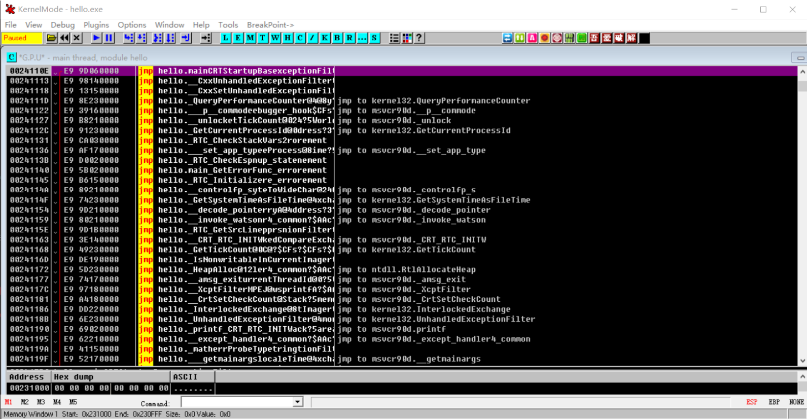

初步调试文件，可以发现许多`jmp`指令，这是编译器生成的启动代码，往下按F8跟随跳转。

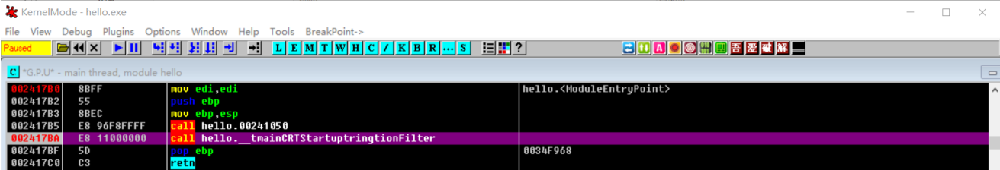

连续按`F8`来到`call tmainCRTStartuptringtionFilter`再一次按`F8`后，整个程序就会返回，因此按`F7`单步进入该函数。

接下来连续按下`F8`，并且观察控制台输出：

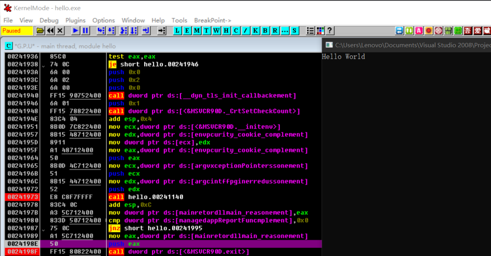

发现再`call hello.00241140`后控制台打出Hello World，因此在此处设下断点。

按下`Ctrl+F2`后重新启动程序，按下`F9`运行到该断点，按下`F7`单步进入。

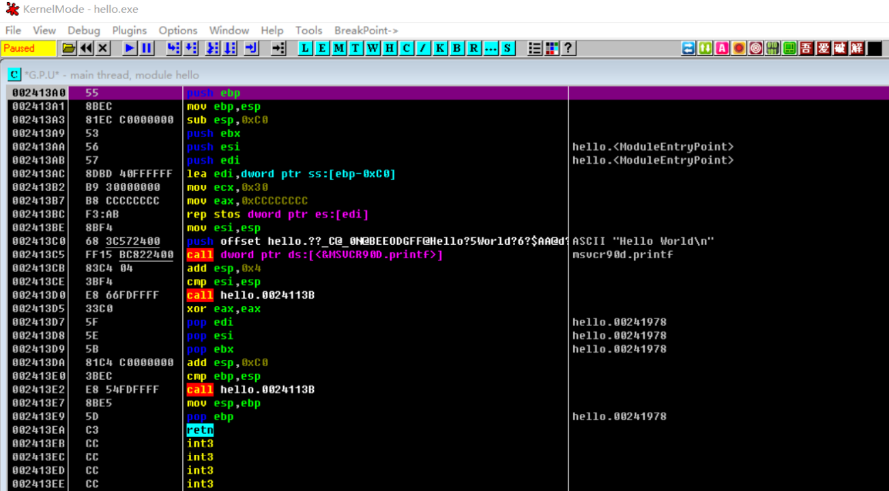

按几次F8后看到如上界面，可以看到Hello World字符串，程序的开头即初始化栈帧操作，显然已经成功来到了main函数中。

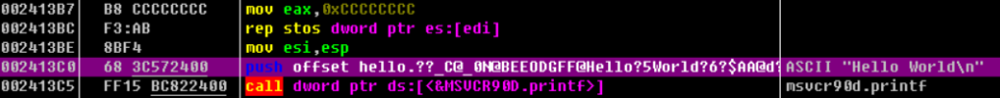

查看如上高亮的指令，该指令将“Hello World”字符串的首地址压入栈中，而后调用printf，将字符串打印在控制台上。

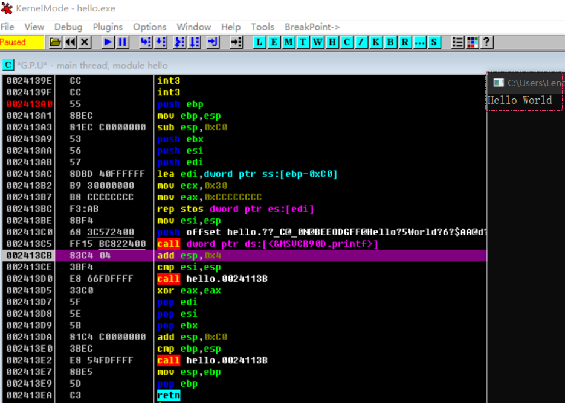

事实也正是如此！

## 函数

C语言程序是由具有不同功能的函数组成的，因此在逆向分析中应将重点放在函数的识别及参数的传递上，这样做可以将注意力集中在某一段代码上。

### 函数的识别

下面讨论**函数的识别**：

调用函数的代码保存了一个返回地址，该地址会与参数一起传递给被调用的函数。绝大多数情况下编译器都使用call和ret指令来调用函数和返回调用位置。

call指令与跳转指令功能类似，但call指令保存返回信息，这里的返回信息实际上主要就是返回地址。

call指令执行时会将其之后的指令地址压入栈的顶部，当遇到ret指令时返回这个地址。

也就是说，call指令给出的地址就是被调用函数的起始地址，ret指令用于结束函数的执行。

因此可以通过定位call指令或ret指令来识别函数，call的操作数就是所调用函数的首地址。

话不多说，看一个例子。

用vs2008编译如下代码，使用OllyDBG进行调试：

```c
#include <stdio.h>

int add(int x,int y)
{
	return x+y;
}

int main(int argc,char* argv[])
{
	int a = 5,b = 6;
	add(a,b);
	return 0;
}
```


进入OD后，依然要越过启动代码，寻找真正的`main`函数。

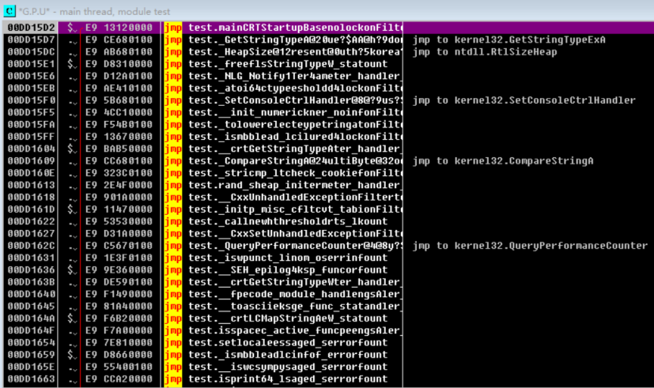

连续按F8。

按照以往的经验，调用`main`函数至少在调用`GetCommandLine`函数之后。

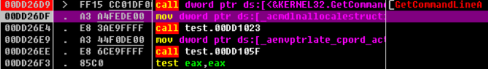

于是这里继续往下执行。

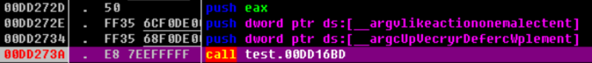

看到这里可以push了3个参数，发现argv和argc的字样，那么下一个call十有八九会到达`main`函数了。

按F7单步进入。

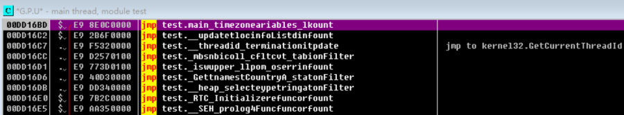

来到这里就已经很明显了，可以明显的看到下图中由`mov ..., 0x5`和`mov ..., 0x6`两个语句，这明显是在给变量赋值上5和6，那么就可以推测`call test.00DD135C`实际上在调用`add`函数，将光标移动指令处，按回车键。

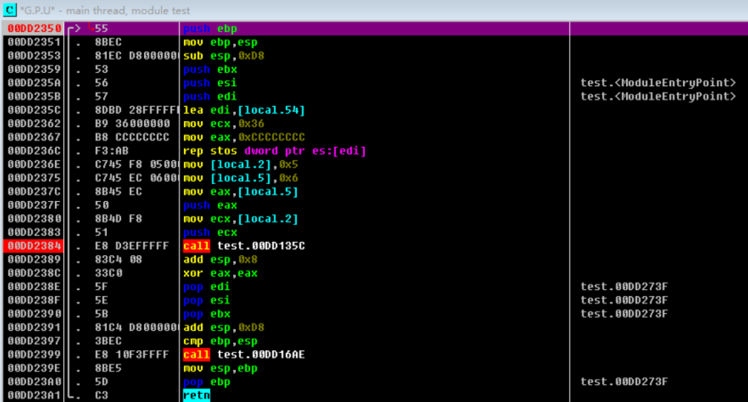

如下图可以看到`add`字样，因此猜想是对的。

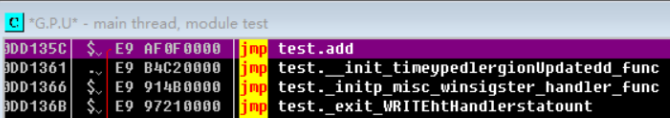

那么回到之前的`main`函数，可以看到代码将0x5和0x6放入rax和ecx寄存器后，又对其进行了压栈操作，实际等价于`push 0x5`和`push 0x6`。

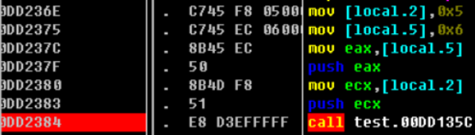

push操作就是x86架构下典型的压栈方式，符合**__cdecl**调用约定(C/C++程序的默认调用约定，在此不作赘述)，在该约定下，可以看到压栈顺序是逆序的，右边的参数先进栈，左边的参数后进栈，栈顶指针esp指向栈中第1个可用的数据项。

在调用函数时，调用者依次将参数压入栈，然后调用函数。函数被调用以后，在栈中取得数据并进行计算，函数计算结束后，由调用者或者函数本身修改栈，使栈恢复原样(平衡栈数据)。

现在将程序运行到call指令之前，查看OD的栈区数据，可以看到显示Arg1=5，Arg2=6，显然这两个参数已经被压栈。

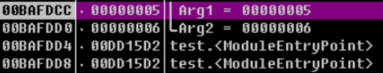

进入add函数后，可以看到程序将arg1存入eax寄存器，再和arg2相加，就完成了计算。

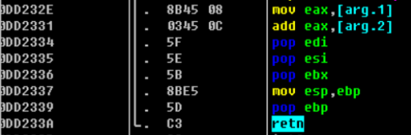

另外还有几种调用约定，如**fastcall**和**stdcall**。

### 函数的返回值

再来讨论**函数的返回值**：

将`add`函数修改一下，如下所示：

```c
int add(int x,int y)
{
	int temp;
	temp = x + y;
	return temp;
}
```

进入OD，再次回到add函数中。

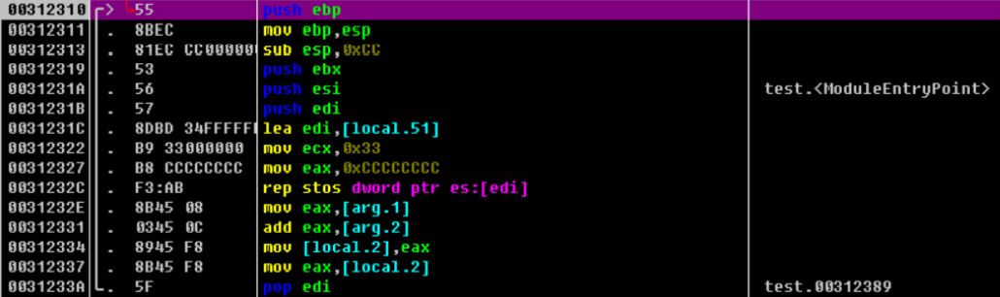

`mov eax, [local.2]`是将计算的最后结果就保存在eax寄存器中，eax就作为存放返回值的寄存器。

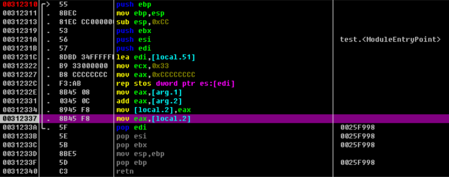

众所周知，带回返回值的方法不只`return`，还可传引用，查看如下代码：

```c
#include <stdio.h>

void max(int* a,int* b)
{
	if(*a < *b) {
		*a = *b;
	}
}

int main(int argc,char* argv[])
{
	int a = 5,b = 6;
	max(&a, &b);
	printf("max: %d",a);
	return 0;
}
```

这里定义了一个`max`函数，接收`a`和`b`的地址，将其中较大数放入变量`a`中。使用OD，进入`main`函数。

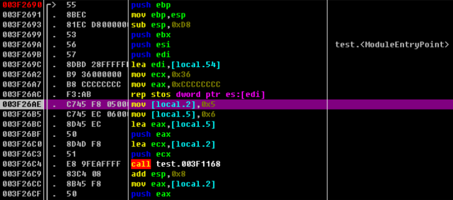

进入`max`函数，`mov eax, [arg.1]`和`mov ecx, [arg.2]`是将参数`a`和`b`的值加载到两个寄存器。

可以看到`cmp`指令，这是一个用于比较大小的指令，紧跟着的是条件跳转指令，表示如果a<b则不跳转，继续往下执行，这里不多说。

直接看到`mov dword ptr ds:[eax], edx`。`dword ptr`是指明数据宽度，而这一步操作就是将结果填入变量a所在的内存地址处。

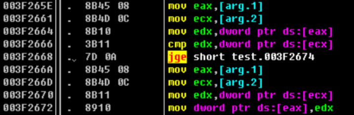

## 数据结构

### 局部变量

现在来谈谈局部变量。

**局部变量**是函数内部定义的一个变量，其作用域和生命周期局限于所在函数内。从汇编角度看，局部变量分配空间时通常会使用栈和寄存器。

编译如下代码：

```c
#include <stdio.h>

int add(int x,int y)
{
	int z;
	z = x+y;
	return z;
}

int main(void)
{
	int a=5,b=6;
	add(a,b);
	return 0;
}
```

进入`add`函数，`sub esp,0xcc`即下降栈顶0xcc个字节，实际上是为局部变量开辟空间，同时也在预防栈溢出攻击(一种攻击手法，此处不作赘述)。

这里开辟后的空间一部分是用来存放变量z的。

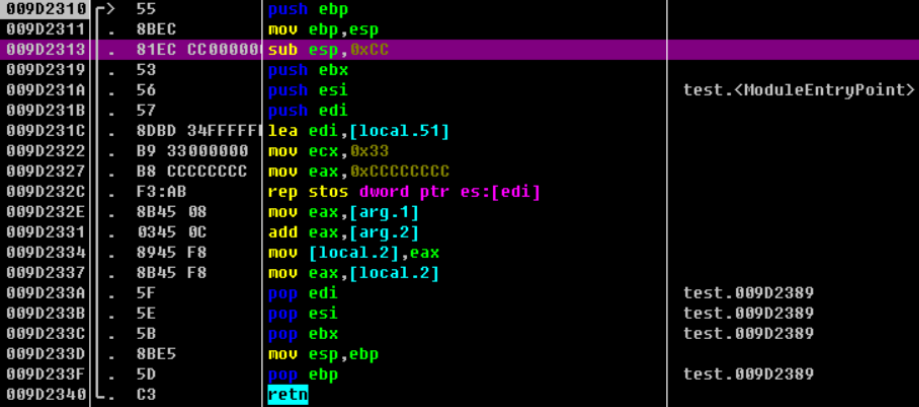

`call`调用完后，会出现`add esp,0x8`这步操作实际上是在平衡栈，可以理解为“回收现场”。

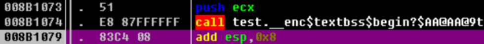

局部变量的起始值是随机的，是其他函数执行后留在栈中的垃圾数据，因此须要对其进行初始化。

### 全局变量

而**全局变量**作用于整个程序，它一直存在，放在全局变量的**内存区**中。

局部变量则存在于函数的**栈区**中，函数**调用结束后便会消失**。

在大多数程序中，**常数**一般放在全局变量中。

全局变量通常位于数据区块(.data)的一个固定地址处，当程序要访问全局变量时，一般会用一个固定的硬编码地址直接对内存进行寻址。

如下是示例程序，`z`是一个全局变量：

```c
#include <stdio.h>

int z;

int add(int x,int y)
{
	return x+y+z;
}

int main(void)
{
	int a=5,b=6;
	z=7;
	add(a,b);
	return 0;
}
```

这里是对z赋值，直接用`mov`将7写入一个固定的内存地址。

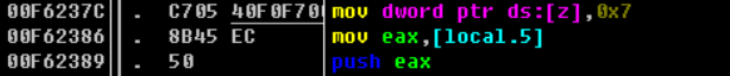

在`add`函数中，同样直接从固定的地址中取出`z`的值到eax寄存器中。

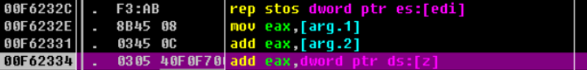

### 数组

最后看看**数组**：

```c
#include <stdio.h>

int main(void)
{
	static int a[3]={0x11,0x22,0x33};
	int i,s=0,b[3];

	for(i=0;i<3;i++)
	{
		s=s+a[i];
		b[i]=s;
	}

	for(i=0;i<3;i++)
	{
		printf("%d\n",b[i]);
	}
	return 0;
}
```

一般对数组的访问是通过基址加变址寻址实现的。

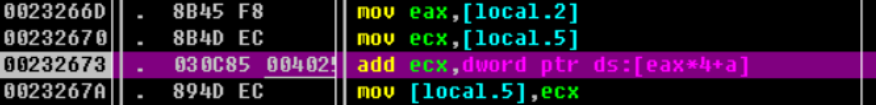

在内存中数组可存在于栈、数据段及动态内存中，本例中`a[]`数组就保存在数据段.data中，其寻址用“基址+偏移量”实现。

`b[]`数组放在栈中，这些栈在编译时分配。数组在声明时可以直接计算偏移地址，针对数组成员寻址时是采用实际的偏移量完成的。

