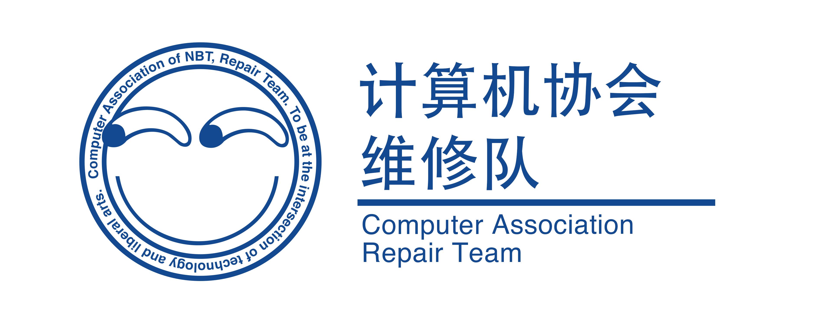

# 写 C 语言的种种工具

## 写在前面

本文记录了千奇百怪的 C/C++编辑器，对各种编辑器做一个简单的评价，避免让大家走弯路踩坑。

文章的本意是想让大家多花些时间在代码上，而不是环境配置上。

希望能够通过本文提升大家在机房打代码的体验。

---

## Dev C++

### 介绍

比较**轻量**的 C/C++的**开源免费**IDE。

[你可以在 SourceForge 上下载安装包(Setup)或者便携程序(Portable)。](https://sourceforge.net/projects/orwelldevcpp/)

**机房的版本是 5.11**，也是原团队最后更新的版本（2015 年）。

**零配置**就可以编译运行 C/C++代码。

**机考**比较理想的选择，个人开发不算特别推荐，有更好的选择。

### 使用技巧

#### 快速开始

点击**文件** -> **新建** -> **源代码**即可直接开始打代码。

点击**编译并运行**按钮(默认快捷键为`F11`)即可运行你的 C/C++代码。

#### 中文设置

主界面工具栏 **Tools** -> **Environment Options** (或者键盘依次按下 Alt, t, v)。

直接在新窗口**General**一栏**Language**一栏选择**简体中文**即可。

如果你是**新安装**的，就很简单了，开启界面就会询问语言：

#### 格式化代码

默认快捷键`Ctrl + Shift + A`，能让你的代码非常**整洁**。

#### 代码补全

默认快捷键是`Ctrl + Space`，和**切换输入法的快捷键冲突无法使用**，需要在**工具** -> **快捷键选项**中设置其他快捷键后使用。

不像其他 IDE 的**自动提示**，Dev C++需要**先按下快捷键**才能出现提示。

除此之外，**C++**也有补全（包括 STL）。

### 优缺点总结

- 开源免费，但已被原团队抛弃（2015 年后没有更新）；
- 有很多其他团队维护的分支版本，有兴趣的可以在网上搜索；
- **机房**比较合适的选择。

---

## Code::Blocks

### 介绍

[你可以在 Code::Blocks 官网下载安装程序。](http://www.codeblocks.org/downloads/binaries/)

**机房**版本为 16.01。

下载时选择带**mingw**的版本可**零配置**编译运行 C/C++代码。

补全能力非常有限。

另外支持格式化。

**上机考比较理想的选择**，**个人用也不错**。

适用于**Windows**，**Linux**及**Mac**。

### 使用方法和技巧

以下演示均为 16.01 版本（即机房的版本）。

#### 快速开始

点击工具栏的中的**File** -> **New** -> **File...**

弹出的窗口中选择**C/C++**然后点击**Go**；

点击**Build and Run**(默认快捷键为`F9`)即可运行程序。

#### 格式化

在编辑器中**右键** -> **Format use AStyle** 即可直接格式化代码。

#### 代码补全

默认开启代码补全，按`tab`或`Enter`都可以完成代码。

从测试可以看到代码补全**功能有限**，仅限**头文件**，**类型**，**数据结构**和一些**标识符**；**函数基本无补全**。

虽然测试比较局限，但大部分的机器基本一致。

### 优缺点总结

- 开源免费，更新活跃；
- 代码补全功能聊胜于无；
- **机房**和**小项目开发**比较合适的选择。

---

## C-Free

### 介绍

首先这个软件是**付费**的，80 元可以免费升级一年。

其次这个软件**最后一次更新在 2010 年**。

**机房电脑基本都有预装，但不如上面提到的两个 IDE，不推荐使用**。

### 优缺点总结

- 付费软件；
- 更新停滞在 2010 年；
- 有其他软件的情况下**不推荐使用**。

---

## Visual Studio Code

### 介绍

微软团队的开源代码编辑器。

[可以在 vs code 官网下载最新版本。](https://code.visualstudio.com/)

想要入门或了解 vs code 的强大功能可以看另一篇文章。

配置相对比较复杂，可以检索网上各种 vs code 配置 C/C++的文章。

适合**个人开发**使用，机房可能需要自己安装，**但机考是不会给机会装软件的**。

### 优缺点总结

- 开源免费；
- 支持非常多编程语言的开发（内置支持或扩展支持）；
- 扩展丰富；
- 设置和扩展设置十分**复杂**，很多开发需要手动配置；
- 适合**个人项目开发**，**机房无预装**。

---

## Visual Studio

### 介绍

微软的 IDE。

[可以在 Visual Studio 官网下载各种版本的安装程序](https://visualstudio.microsoft.com/zh-hans/)。

基本可以**零配置**写 C/C++，C#等。

这个比较适合写大型的 C/C++项目。

目前最新版已经到了 2022，支持 64 位。

安装时只需要**选择自己需要的模块**，之后也可以随时安装卸载其他模块，不需要纠结太多。

### 优缺点总结

- 社区版免费，功能够用；
- 体积占用过大；
- 开发**有规模的项目**合适；不能运行单文件，必须创建项目；**机房无预装**。

---

## CLion

### 介绍

JetBrains 开发的 IDE。

[可以在官网下载最新版本](https://www.jetbrains.com/clion/)。

基本**零配置**即可编译运行 C/C++代码。

全系软件都是**付费订阅制**，但**在读学生可以免费使用**，用**学校邮箱**注册认证学生身份即可。

### 优缺点总结

- 学生免费；
- 体积占用相对较大；
- 适合开发**有规模的项目**；**机房无预装**。

## 总结

- 如果上**机房**，**Dev C++**和**Code::Blocks**这两个预装的软件是比较好的，课程如果有需要机考的强烈建议熟悉一下；
- 其他情况像**大作业和项目开发**，**vs code**、**Visual Studio**和**CLion**是非常好的选择。

当然，机考能不能过还是要看个人积累的，工具及熟练度只占一小部分。

趁着还在学 C 语言，打好**数据结构**和**算法**的基础，到哪都不慌。

---

## 关于计算机协会

- 计协有自己的博客啦：https://nbtca.space/
- 如果你**碰到学习中的种种问题**，想更加**深入学习计算机软硬件知识**；做**网页**，做**游戏**，做**应用**；修**电脑**，玩**硬件**，做**志愿者活动**；不妨来**计算机协会之家**看看，总有热心的程序员~~秃头~~会解决你的问题！

- 关注我们定期举办的**理工维修日**（不仅仅是维修），成为**志愿者**，或是来这里进行**软件配置**问题和**硬件**咨询，我们非常欢迎！

<!-- for wechat -->
<!--  -->
