## Linux进程

本文会简单讲述进程创建和进程间通信。

简单说一下，进程是操作系统调度资源的基本单位，比如将可执行程序跑起来就变成了进程。

进程是由数据(全局变量、静态变量、只读变量...)、代码和堆栈(局部变量、动态分配的内存...)组成的。

进程的模式有用户模式、内核模式。

可以输入`ps`命令来查看正在运行的进程：

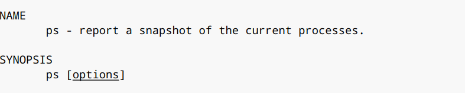

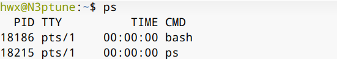

`ps -aue`命令可以查看更为详细的信息：

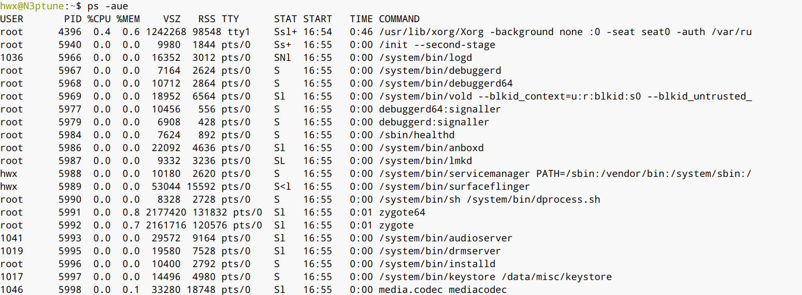

`top`命令可以实时查看正在运行的程序：

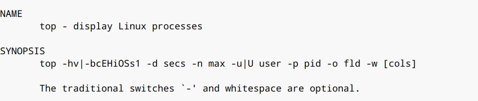

在终端输入`top`，输入q可以退出：

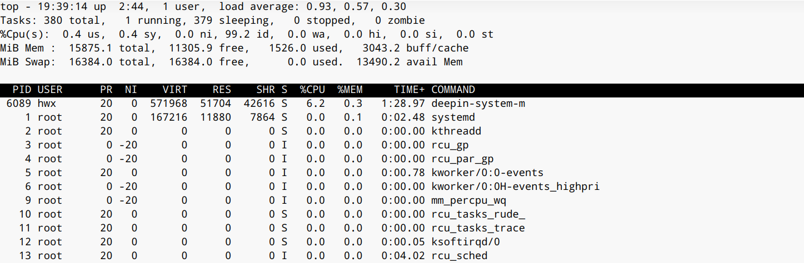

Linux系统上可以管理多个进程，进程被分时分片处理。

下面演示在程序中如何创建进程：

1. `system`函数可以在命令行中执行命令，可以借此来创建一个进程，不作赘述

   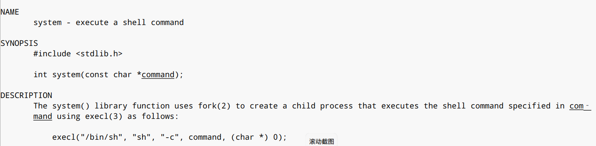

2. `fork`函数、`vfork`函数 创建子进程: 当前进程是父进程，被创建进程是子进程，创建完后父子进程通知执行

   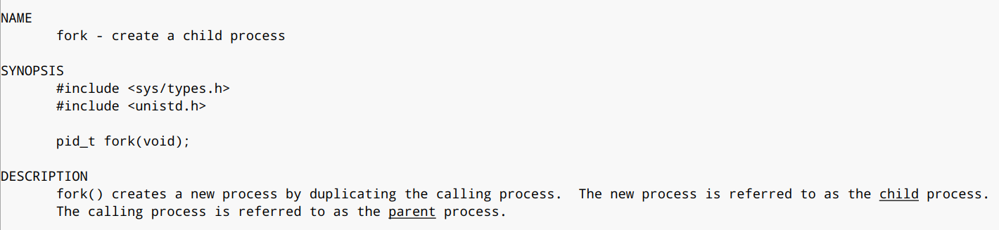

3. `exec`家族

   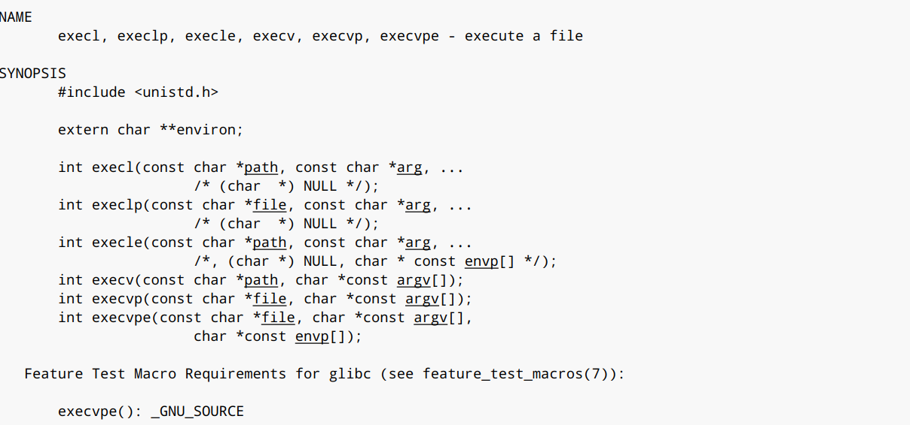

   这些函数都可以创建一个进程，暂且不展开描述。

进程有很多种状态，例如运行时、睡眠、挂起、等待、死亡、僵尸...

下面代码演示：

```c
#include <stdio.h>
#include <unistd.h>

int main(void)
{
    printf("This is parent process,pid: %d\n",getpid());
    sleep(2);
    printf("Create child process\n");
    int ret = fork();
    if (ret) {
        printf("This is parent process: %d\n",getpid());
        while(1) sleep(1);
    }
    else {
        printf("This is child process: %d\n",getpid());
        while(1) sleep(1);
    }
    return 0;
}
```

运行这个程序，程序已经打印出了进程号：

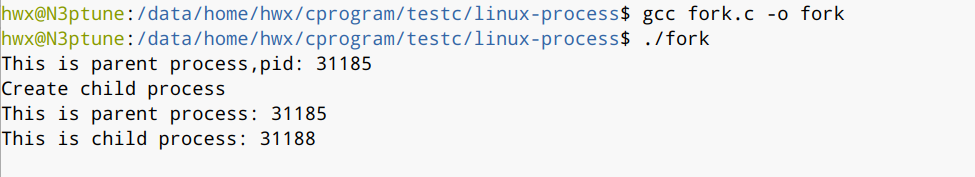

这里有必要明确一下`fork`函数的返回值：

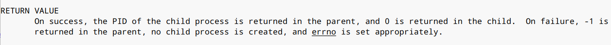

根据fork函数的返回值来看是在子进程中还是父进程中，调用成功的话，父进程中返回值是子进程的ID，子进程中是0。实际上这里fork返回了两次。

fork做了两件事，第一件是复制结构，将父进程的数据结构都复制了一份。

第二件事就是唤醒新进程，让子进程运行起来。

运行如下代码：

```c
#include <stdio.h>
#include <unistd.h>

int main(void)
{
    printf("This is parent process,pid: %d\n",getpid());
    sleep(2);
    printf("Create child process\n");
    int ret = fork();
    int n = 10;
    if (ret) {
        printf("This is parent process: %d\n",getpid());
        while(1) {
            printf ("n = %d\n",n++);
            sleep(1);
        }
    }
    else {
        printf("This is child process: %d\n",getpid());
        while(1) {
            printf("n = %d\n", n += 2);
            sleep(1);
        }
    }
    return 0;
}
```

在代码中定义了一个变量n，初始值为10，子进程的n同样初始为10：

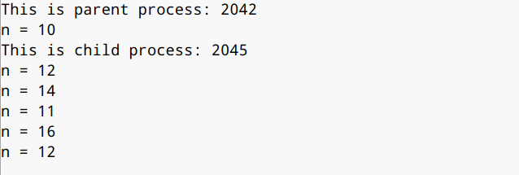

下面谈谈僵尸进程。

有一种情况，父进程创建了子进程，父进程先于子进程结束，子进程资源没有被释放，就会变成僵尸进程，持续占用系统资源(内核中进程树会保存进程的数据，树中节点会保存进程的一些数据)。

子进程结束前，会向父进程发送SIGCHILD信号，父进程收到信号后，回收子进程资源，然后父进程再结束。父进程可以写一个wait函数，等待子进程发送SIGCHILD信号。

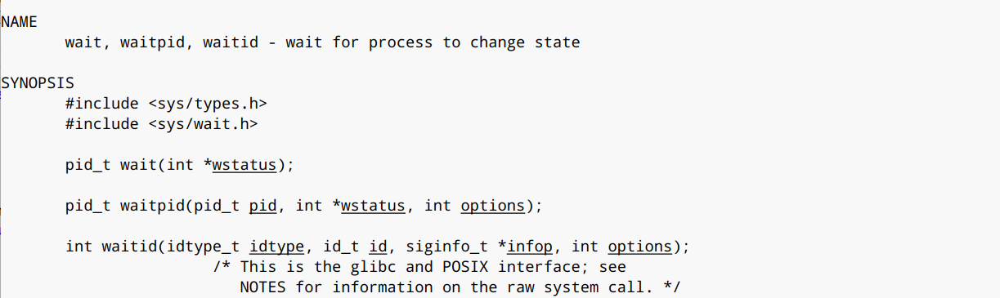

如下是代码演示：

```c
#include <stdio.h>
#include <unistd.h>

int main(void) {
    if (fork()) {
        printf("create child process\n");
        wait(0);
    }
    else {
        for(int i=0;i<5;i++) {
            printf("child process: %d\n",i);
            sleep(1);
        }
    }
    printf("end parent process\n");
    return 0;
}
```

使用wait函数就是要等待子进程打印完所有数字，父进程才结束。

最后看看守护进程。

守护进程是一个独立的进程，最常见的用途就是记录其他进程的情况，保存系统日志。

终端输入`ps axj`可以查看系统中的守护进程：

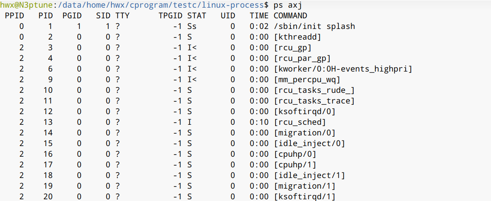

TPGID为-1的话，就说明是守护进程。

如果要把一个进程变成守护进程，要先`kill`其父进程，同时摆脱终端的控制。

要摆脱终端的控制，就要关闭三个文件描述符号：标准输入设备，标准输出设备，标准错误输出设备，然后重定向当前进程IO操作到/dev/null (黑洞设备)。然后要创建新的会话，摆脱原有会话进程组的控制。

这里要提到进程的组织形式：多个进程组成一个进程组，多个进程组组成一个会话。这里不详细解释会话是什么。

守护进程创建编程模型：

第一种:

1. 创建新会话 `setsid`;

2. 改变当前工作目录 `chdir`;

3. 重设当前文件权限 `umask`;

4. 关闭文件 `fclose`.

第二种：

       1. 重设文件权限 `umask;`
       2. 创建子进程 `fork`;
       3. 结束父进程;
       4. 创建新会话 `setsid;`
       5. 防止子进程成为僵尸进程 忽略SIGCHILD SIGUP信号;
       6. 改变当前工作目录 `chdir`;
       7. 重定向文件描述符号 `open dup(fd,0) dup(fd,1)` .

下面演示创建守护进程：

```c
#include <stdio.h>
#include <unistd.h>
#include <sys/wait.h>
#include <sys/types.h>
#include <sys/stat.h>
#include <signal.h>
#include <stdbool.h>
#include <fcntl.h>
#include <stdlib.h>

int main(void)
{
    // 重设文件权限
    umask(0);
    // 创建子进程 结束父进程
    int ret = fork();
    if (ret < 0) {
        printf("create process failed: %m\n");
        exit(-1);
    }
    if (ret > 0) {
        printf("parent process end\n");
        exit(0);
    }
    if (0 == ret) {
        printf("pid: %d\n",getpid());
        // 创建新会话
        setsid();
        // 防止子进程成为僵尸进程 忽略SIGCHILD、SIGUP信号
        signal(SIGCHLD,SIG_IGN);
        signal(SIGHUP,SIG_IGN);
        // 改变当前工作目录
        chdir("/");
        // 重定向文件描述符号 open、dup函数
        int fd = open("/dev/null",O_RDWR);
        dup2(fd,0);
        dup2(fd,1);
    }
    //模拟守护进程工作
    while (true) {
        sleep(1);
    }
    return 0;
}
```

在终端中编译运行：

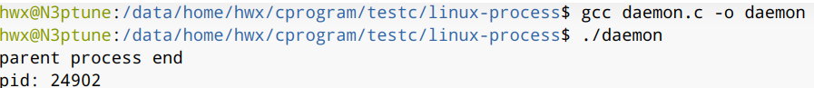

现在关闭终端，在命令行输入`ps -axj`，可以看到运行起来的守护进程还在运行：


这里要用`kill`杀掉进程。

接下来谈进程间通信。

顾名思义，要实现不同进程间进行传递信息。

这里可以分为两大类，一个是不同主机上的进程间进行通信(网络通信)，另一个是同一主机上的进程进行通信。

先谈同一主机上进程通信，此时又可以分为两类：父子进程间通信和非父子进程间通信。

上文提到，`fork`子进程会拷贝父进程的数据，因此父子进程间通信还是比较简单的。

第一种通信方式，较为朴素，使用普通文件，进程A将要传递的信息放入这个文件，进程B再去读这个文件即可。父子进程间可通过文件描述符号，非父子进程之间就只能通过具体文件来通信。

第二种方式，文件映射虚拟内存 `mmap`。

第三种方式，匿名管道(父子间进程使用)和有名管道(非父子进程间使用)。

除此之外，还有信号、共享内存、消息队列、信号量和网络可用于通信。

本文主要讲前3种。

下面代码简单演示了第一种：

```c
#include <unistd.h>
#include <stdlib.h>
#include <fcntl.h>
#include <stdbool.h>
#include <stdio.h>

// 通过文件进行通信
// 父进程往文件里写入数据
// 子进程读出来并打印

int main(void)
{
    int fd = open("test.dat",O_CREAT,0666);
    if (-1 == fd) {
        printf("创建文件失败\n");
        exit(-1);
    }
    printf("创建文件成功\n");
    if (fork()) 
    {
        int n = 0;
        while(true) {
            int fd = open("test.dat",O_WRONLY);
            write(fd,&n,4);
            close(fd);
            sleep(1);
            n++;
        }
    }
    else 
    {
        int m;
        while(true) {
            sleep(1);
            int fd = open("test.dat",O_RDONLY);
            read(fd,&m,4);
            close(fd);            
            printf(">> %d\n",m);
        }
    }
}
```

运行程序，可以看见子进程将父进程写入文件的数据都打印了出来：

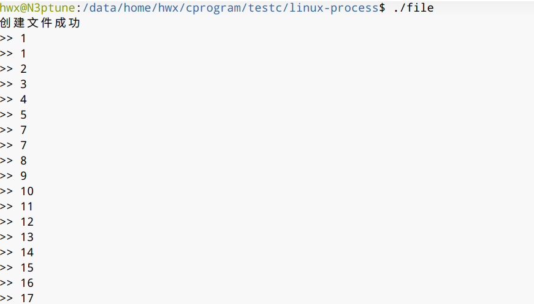

下面讨论管道。

管道也是FIFO结构，分为两种，匿名管道和有名管道。

父子进程使用匿名管道。

1. 创建文件描述符号；

2. 将文件描述符号变成管道。

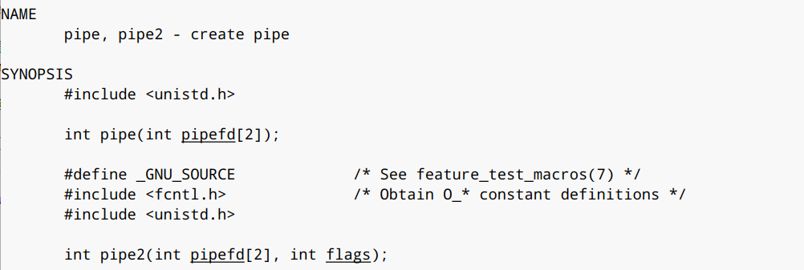

```c
#include <unistd.h>
#include <stdlib.h>
#include <fcntl.h>
#include <stdio.h>
#include <string.h>
#include <sys/types.h>

// 使用匿名管道
int main(void)
{
    // 创建管道描述符号
    int fd[2];
    int ret = pipe(fd);
    if (ret == -1) {
        printf("创建管道失败\n");
        exit(-1);
    }
    printf("创建管道成功\n");
    // 父子进程之间使用管道
    if (fork()) {
        char buff[1024] = {0};
        while(true) {
            scanf("%s",buff);
            write(fd[1],buff,strlen(buff));
        }
    }
    else {
        char temp[1024] = {0};
        while(true) {
            ret = read(fd[0],temp,1023);
            if (ret > 0) {
                temp[ret] = 0;
                printf(">> %s\n",temp);
            }
        }
    }
    close(fd[0]);
    close(fd[1]);
    return 0;
}
```

上述代码的功能是父进程接收用户输入后传入管道，子进程从管道读出并显示。

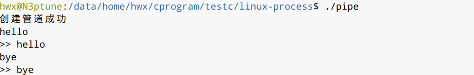

接着演示有名管道，流程如下：

| 进程A               | 进程B              |
| ------------------- | ------------------ |
| 创建管道文件 mkfifo |                    |
| 打开管道文件        | 打开管道文件       |
| 往管道文件写入数据  | 从管道文件读取数据 |
| 关闭管道            | 关闭管道           |
| 删除管道文件        |                    |
|                     |                    |

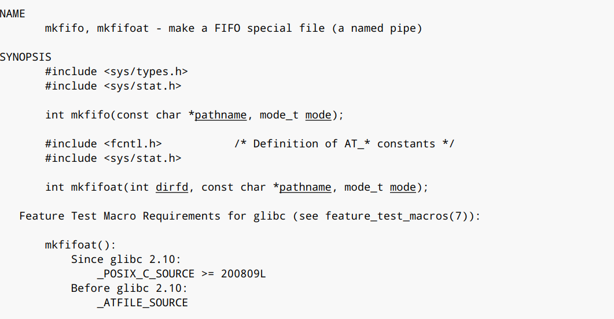

进程A的代码：

```c
#include <unistd.h>
#include <stdlib.h>
#include <string.h>
#include <fcntl.h>
#include <stdbool.h>
#include <stdio.h>
#include <sys/types.h>
#include <sys/stat.h>

int main(void)
{
    // 创建管道文件
    int ret = mkfifo("test.pipe",0);
    if (-1 == ret) {
        printf("创建管道文件失败:%m\n");
        exit(-1);
    }
    printf("创建管道文件成功\n");
    // 打开管道文件
    int fd = open("test.pipe",O_WRONLY);
    if (-1 == fd) {
        printf("打开管道文件失败:%m\n");
        unlink("test.pipe");
        exit(-1);
    }
    printf("打开管道文件成功\n");
    // 循环写入
    int n = 0;
    char buff[1024] = {0};
    while(true) {
        sprintf(buff,"Hello Linux %d",n++);
        write(fd,buff,strlen(buff));
        sleep(1);
    }
    close(fd);
    unlink("test.pipe");
    return 0;
}
```

进程B：

```c
#include <unistd.h>
#include <stdlib.h>
#include <string.h>
#include <fcntl.h>
#include <stdbool.h>
#include <stdio.h>
#include <sys/types.h>
#include <sys/stat.h>

int main(void)
{
    // 打开管道文件
    int fd = open("test.pipe",O_RDONLY);
    if (-1 == fd) {
        printf("打开管道文件失败:%m\n");
        unlink("test.pipe");
        exit(-1);
    }
    printf("打开管道文件成功\n");
    // 循环读取
    while (true) {
        char buff[1024] = {0};
        int ret = read(fd,buff,1023);
        if (ret > 0) {
            buff[ret] = 0;
            printf(">>> %s\n",buff);
        }
    }
    close(fd);
    unlink("test.pipe");
    return 0;
}
```

运行结果：


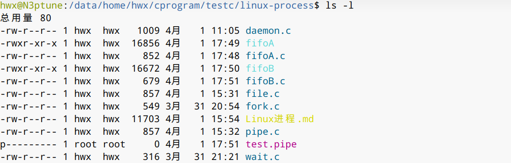

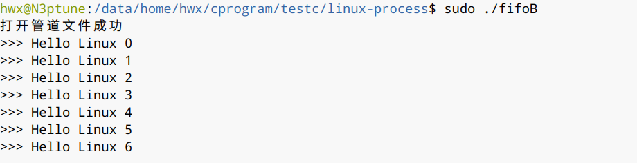

这里要注意的是，这个程序不能在共享的文件夹下运行，因为共享文件夹下不能创建管道。同时必须两个进程都打开，这个程序才能返回，否则会阻塞。先关闭读取端，会导致写入端结束而先关写入端，不会对读取端造成影响。
