## Linux 文件系统结构

文件结构是文件存放在磁盘等存储设备中的组织方法，主要体现在对文件和目录的组织上，目录提供了管理文件的一个方便而有效的途径，用户能够从一个目录切换到另一个目录，而且可以设置目录和文件的权限，设置文件的共享程度。

Linux 文件系统是目录和文件的一种层次安排，目录的起点称为**根**(root)，其名字是一个字符`/`目录(directory)是一个包含目录项的文件，在逻辑上可以认为每个目录都包含一个文件名，同时包含说明该文件的信息 ，文件属性是文件类型、文件长度、文件所有者、文件许可权(其他用户是否能访问该文件)、文件最后修改的时间等。

使用 Linux 的用户可以设置目录和文件的权限，以便允许或拒绝其他人对其进行访问，Linux 目录采用多级树形等级结构，用户可以浏览整个系统，可以进入如何一个已授权进入的目录，访问那里的文件。

文件结构的相互关联性使共享数据变得很容易，几个用户可以访问同一个文件。

Linux 是一个**多用户系统**，操作系统本身的驻留程序存放在以根目录开始的专用目录中，有时被指定为系统目录。 **内核**、**Shell**和**文件结构**一起形成了 Linux 的基本操作系统结构。它们使得用户可以允许程序， 管理文件及使用系统。

### 文件类型

在终端输入`ls -l`命令 系统会打印处当前目录下所有文件的信息。

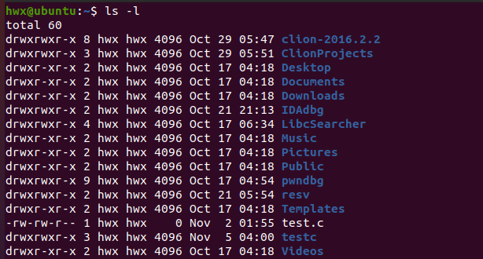

这些信息包括：**文件类型**、**文件属性**、**用户名**、**用户所在组**、**文件大小**、**修改时间**、**文件名**等。

而其中的第一栏信息是文件类型和文件属性 包含了 10 个字符 分为 4 组：

- 第**1**位表示文件的类型；
- 第 2 组为**2-4**位 代表文件所有者(User)权限，分别为**读**、**写**、**执行**；
- 第 3 组为**5-7**位代表文件所有者的同组用户(Group)的权限，分别为**读**、**写**、**执行**；
- 第 4 组为**8-10**位 代表其他组用户(Other)权限，分别为**读**、**写**、**执行**。

1. **普通文件**：符号是 - 例如保存在磁盘上的 C 文件、可执行的文件以及目录等，这种文件的特性是数据在存储 设备上存放，内核提供了对数据的抽象访问，此种文件为一种**字节流**，访问接口完全独 立于磁盘上的存储数据 ；
2. **目录文件**：符号是 d ；
3. **字符设备文件**：符号是 c ，是一种能够像文件一样被访问的设备，例如控制台、串口等 ；
4. **块设备文件**：符号是 b 磁盘是此类设备文件的典型代表，与普通文件的区别是操作系统对数据的访问进行的**重新的格式设计** ；
5. **符号链接文件**：符号是 l ；
6. **socket 文件**：是 UNIX 中通过网络进行通信的方式，对网络的访问可以通过文件描述符实现，访问网络和访问普通文件相似。

在 Linux 中用户空间对各种文件的操作是类似的，因为虚拟文件系统 VFS 同一套 API。

#### 简单实验

文件系统的创建：

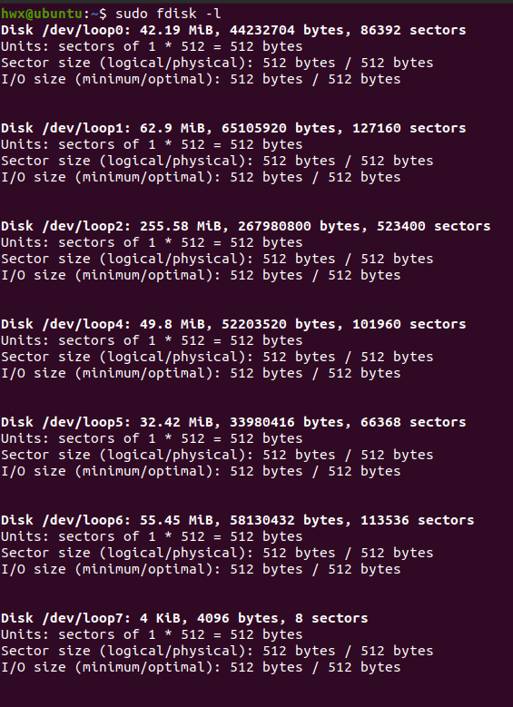

### 基于文件描述符的 IO 操作

#### 文件描述符

操作系统内核(kernel)利用文件描述符(file descriptor)来访问文件。

文件描述符是一个非负整数，是一个用于描述被打开文件的索引值，它指向该文件的相关信息的记录表。

当内核打开一个现存文或创建一个新文件时，就会返回一个文件描述符，当读、写文件时， 也需要使用文件描述符来指定待读写的文件。

##### POSIX 可移植操作系统接口

文件描述符的有效范围是 0 到 OPEN_MAX 一般来说，每个进程最多打开 1024 个文件(0~ 1023)，这个值可以使用 ulimit -n 命令查看。

文件描述符是由无符号整数表示的句柄，进程使用它来标识打开的文件。

文件描述符与包括相关信息(如文件的打开模式、文件的位置类型、文件的初始类型等)的文件对象相关联，这些信息被称作文件的**上下文**。

##### 标准输入、标准输出和标准出错

在 UNIX\Linux 系统中，每当运行一个新程序时，所有的 shell 都为其打开 3 个文件描述符： 标准输入、标准输出及标准出错，分别对应 0 1 2。

#### 文件的创建、打开和关闭

要对一个文件进行操作，首先要求这个文件**存在**，其次是要在操作之前将这个文件**打开**，这样才能实现对该文件的操作，当完成操作后，则必须将文件关闭，文件的创建、打开与关闭是文件 I/O 操作的第一步。

##### open 函数

调用`open`函数可以打开或创建一个文件。

函数原型：`int open(const char* pathname,int flags);`

增加一个参数：`int open(const char* pathname,int flags,mode_t mode);`

返回值：若成功则返回文件描述符，若出错则返回-1。其中参数`pathname`是一个字符串指针，指向需要打开(或创建)文件的**绝对路径名**或**相对路径名**。

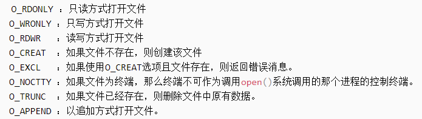

`mode`取值：

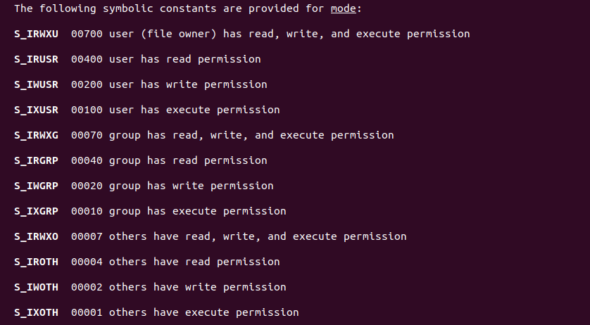

###### 案例程序

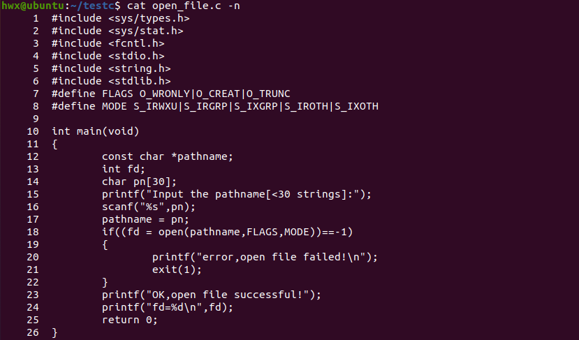

将`FLAGS`定义为：只写，不存在则创建，文件长度截短为 0。

定义`mode`:创建文件的权限为用户读写执行，组读、执行，其他用户读、执行。

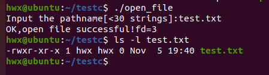

运行程序后创建一个新文件：`test.txt`。

查看其权限属性，可见恰好与创建时定义的 mode 吻合。

##### creat 函数

用于创建文件。

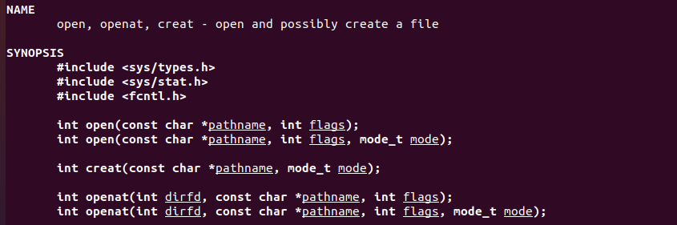

函数原型：`creat(const char *pathname,int flags);`

若成功则返回以只写方式打开的文件描述符，若出错为-1 参数 pathname 和 mode 的含义与 open 函数的含义相同。

`creat`函数等效于`open(pathname,O_WRONLY|O_CREAT|O_TRUNC,mode);`其有一个不足之处是它以只写方式打开所创建的文件。

在提供 open 的新版本之前，如果要创建一个临时文件，并要先写该文件，然后又读该文件，则必须先调用`create`、`close`，然后再调用`open`。

##### close 函数

close 函数用于关闭一个文件。

若成功则返回 0，若出错则返回-1。

参数`fd`是需关闭文件的文件描述符 系统调用`close`不经将释放该文件的描述符，而且也将释放该文件所占的描述表项。

关闭一个文件时也释放该进程加载该文件上所有的记录锁。当一个进程终止时，它所有的打开文件都由内核自动关闭。

文件的定位 每个已打开的文件都有一个与其相关联的**当前文件位移量**，它是一个非负整数，用以度量从文件开始处计算的字节数。

通常，读、写操作都从当前文件位移量处开始，并且使位移量增加所读或写的字节数。

系统默认设置位移量为 0。

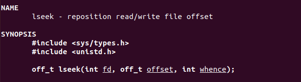

可以调用`lseek`函数显式地定位一个打开文件 若成功则返回新的文件位移量，出错则返回-1。

l 表示长整型 参数`fd`表示已打开文件的描述符，参数`offset`表示位移量大小，单位字节，对参数`offset`的解释于参数`whence`的取值有关。

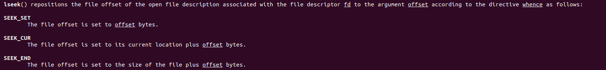

可见当`whence`取`SEEK_CUR`和`SEEK_END`时，可以取负值。

###### 测试程序

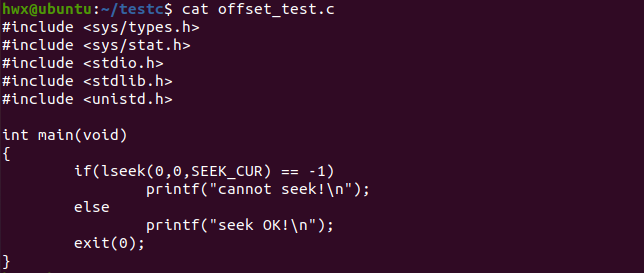

该程序可测试标准输入能否被设置成偏移量：

默认标准输入是键盘 从程序的运行结果看出 对于标准输入一般不能设置位移量。

但对系统中文件以及用户创建的一般文件是可以设置位移量的。

通常情况下 文件的当前位移量应当是一个非负整数，但是某些设备也可能允许负的位移量。但对于普通文件，则其位移量必须是非负值。

`lseek`仅将当前的文件位移量记录在内核内，并不能引起如何 I/O 操作，然后该位移量用于下一个读或写操作。

文件位移量可以大于文件的当前长度，在这种情况下，对该文件的下一次操作将延长该文件，并在文件中构成一个空洞，这一点是允许的。

#### 文件的读写

文件的读写操作的系统调用分别是`read`和`write`。

##### read 函数

从打开文件中读取数据返回：读到的字节数，若已到文件尾返回 0，若出错为-1。

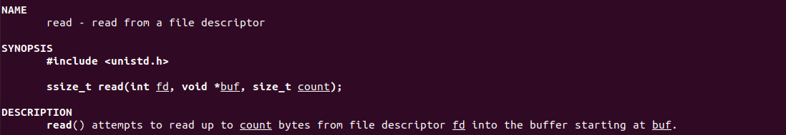

- 其中参数`fd`表示要进行读操作的文件的描述符；
- `buf`是一个指向缓冲区的指针，该缓冲区存放将要读取到中断的数据；
- `count`表示本次操作将要读取的数据的字节数。

读操作从文件的当前位移量处开始，在成功返回之前，该位移量增加实际读得的字节数

有几种情况可使实际读到的字节数少于要求读的字节数：

1. 读普通文件时，在读到要求字节数之前已到达了文件尾端；
2. 从终端设备读时，通常一次最多读一行；
3. 从网络中读；
4. 面向记录的设备。

##### write 函数

打开文件写入数据，若成功则返回写的字节数，若出错为-1。

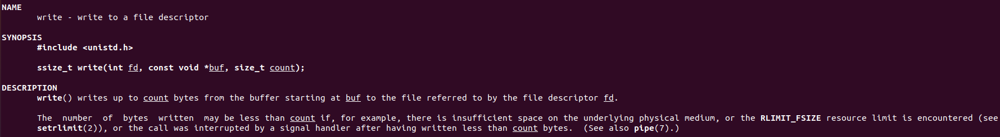

对于普通文件 ，写操作从文件的当前位移量处开始，如果在打开该文件时，指定了 O_APPEND 选择项，则在每次写操作之前，将文件位移量设置在文件的当前结尾处。在一次成功操作写之后，该文件位移量增加实际写的字节数。

###### 案例程序

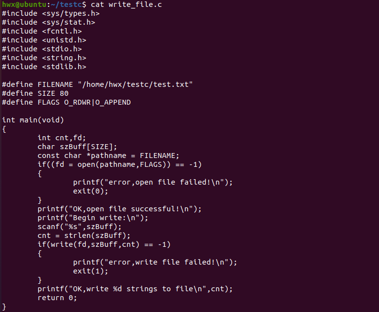

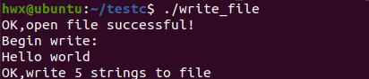

###### 另外的程序

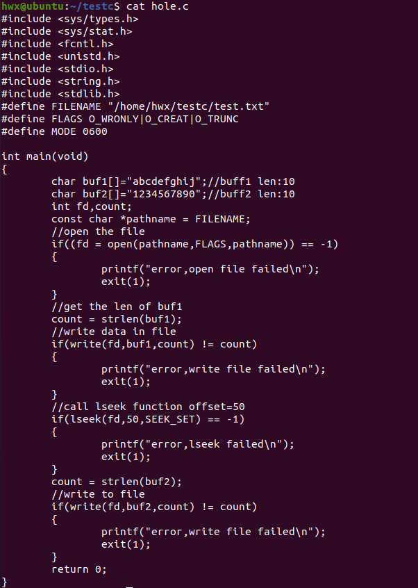

该程序首先打开(或创建)文件`/home/hwx/test.txt`接着调用 write 函数将缓冲区 1 的数据写入文件，此时写入的数据长度为 10，然后调用 lseek 定位文件，文件偏移量为 50，并从文件开头计算偏移值，最后调用 write 将缓冲区 2 的数据也写入文件，写入的数据长度也为 10。

在第二次写入数据时 之间 40 字节的内容为空 文件的总长度为 60 成功运行程序后 利用 ls 和 od 命令可以检验出：

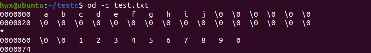

使用 od 命令观察该文件的实际内容。(命令行中的-c 标志表示以字符方式打印文件内容)

中间 40 字节全为 0。

### 文件的属性操作

Linux 的文件系统具有比较复杂的属性，包括**文件访问权限**、**文件所有者**、**文件名本身**、**文件长度**等。

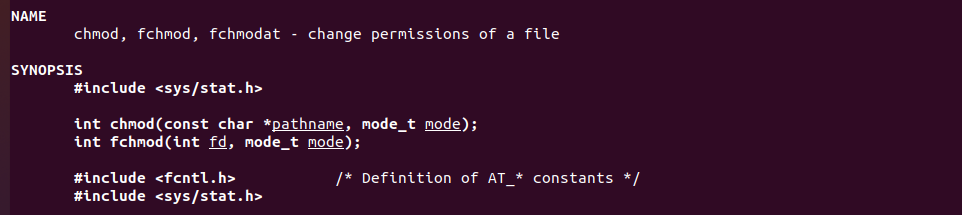

改变文件访问权限：`chmod`、`fchmod`这两个函数使用户可以更改现存文件的存取许可权

两个函数的返回：若成功则为 0，出错则为-1。

`chmod`函数在指定的文件上进行操作，pathname 指定了这个文件的绝对路径名或相对路径名，而`fchmod`函数则对已打开的文件进行操作，`fd`是这个打开文件的描述符。

为了改变一个文件的访问许可权位 进位的有效用户 ID 必须等于文件的所有者(User)或者该进程必须具有 root 权限。

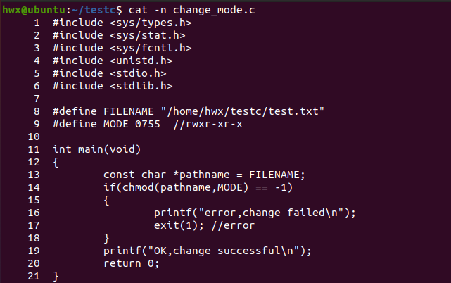

当前`test.txt`文件权限:

可见运行程序后文件权限被改变。

### 文件的其他操作

Linux 系统中所有文件都有一个与之对应的索引节点，该节点包含了文件的相关信息。

这些信息被保存在 stat 结构体中，可以通过调用下面 3 个 stat 函数来返回文件的信息：

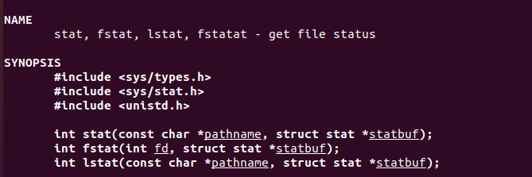

**stat**函数、**fstat**函数和**lstat**函数。

若成功则返回 0，出错则返回-1。

- **stat**函数返回指定文件的信息结构，参数 pathname 指定了该文件的绝对路径名或相对路径名；
- **fstat**函数获得已在描述符 fd 上打开的文件的有关信息；
- **lstat**函数类似于 stat，但是当命名的文件是一个符号链接时，lstat 返回该符号链接的有关信息，而非由该符号链接引用的文件的信息 0。

## 基于流的 I/O

### 流和 FILE 对象

对于标准 I/O 库，它们的操作则是围绕流进行的，当用标准 I/O 库打开或创建一个文件时，已使一个流与一个文件相结合。I/O 函数 fopen 返回一个指向 FILE 对象的指针。该对象通常是一个结构体，包含了 I/O 库为管理该流所需要的所有信息，包括实际用于 I/O 的文件描述符，指向流缓存的指针，缓存的长度，当前在缓存中的字符数，出错标志等。

### 大致过程

对流进行操作的第一步是通过调用`fopen`函数将其打开，并返回一个 FILE 结构指针。当流成功打开以后就可以调用相应的库函数对其进行 I/O 操作。当完成操作后要执行清空缓冲区、保存数据等操作，然后将流关闭，这些工作可通过`fclose`函数来完成。

当使用流 I/O 时，有 3 个流会自动地打开：标准输入、标准输出和标准错误，用文件描述符`STDIN_FILENO`、`STDOUT_FILENO`、`STDERR_FILENO`表示它们，这 3 个符号定义在头文件`unistd.h`。

而在基于流地 I/O 操作中，通过预定义文件指针`stdin`、`stdout`和`stderr`来引用标准输入、标准输出和标准出错。

### 缓存

基于流地操作最终会调用`read`或者`write`函数进行 I/O 操作。为了提高程序的运行效率，尽可能减少使用 read 和 write 调用的数量，流对象通常会提供缓冲区,以减少调用系统 I/O 库函数的次数，缓存用 3 种类型：

1. 全缓存(`_IO_FULL_BUF`)：直到缓冲区被填满，才调用系统 IO 函数，直到读入的内容的字节数等于缓冲区大小或者文件已经到达结尾，才进行实际的 I/O 操作，将外村文件内容读入缓冲区，对于写操作来说，直到缓冲区被填满，才进行实际的 I/O 操作；
2. 行缓存(`_IO_LINE_BUF`)：直到遇到换行符`\n` 才调用系统 I/O 库函数，对于读操作来说，遇到换行符`\n`才进行 I/O 操作，将缓冲区内容写到外存中。由于缓冲区大小是有限的，所以当缓冲区被填满时，即使没有遇到换行符`\n`，也同样会进行实际的 I/O 操作；
3. 无缓存(`_IO_UNBUFFERED`)：没有缓冲区，数据会立即读入或者输出到外存文件和设备上。标准出错 stderr 是无缓冲的，这样保证错误提示和输出能够即使反馈给用户，供用户排除错误。

## 深入探究 I/O

### 原子操作和竞争条件

所有系统调用都是以原子操作方式执行的，内核保证了某系统调用中的所有步骤会作为独立操作而一次性加以执行，其间不会为其他进程或线程所中断。

原子性规避了竞争状态，竞争状态：操作共享资源的两个进程(或线程)，其结果取决于一个无法预期的顺序，即这些进程获得 CPU 使用权的先后相对顺序。

### 文件 I/O 的两种竞争状态

以独占方式创建一个文件, 当同时指定`O_EXCL`与`O_CREAT`作为`open`的标志位时，如果要打开的文件依然存在，则`open`将返回一个错误。

这提供了一种机制，保证进程是打开文件的创建者。对文件是否存在的检查和创建文件属于同一原子操作。

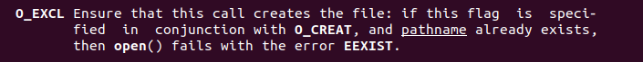
