## Python爬虫实战-获取王者荣耀英雄大全

URL: https://pvp.qq.com/web201605/herolist.shtml

#### 前置准备

访问后页面如下所示:：

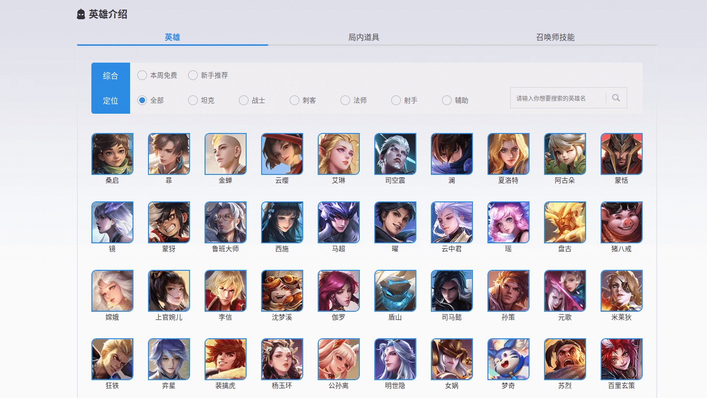

不难发现，这是静态网页，对于众多英雄的信息，并未使用js渲染，这貌似是个软柿子？

按下F12使用开发者工具，点击Doc，查看请求的Reponse，可以看到众多英雄的信息在这个静态文档列举了出来，于是似乎只要按照html标签就可以轻松获取信息(*<u>后面会解释，这实际上是个坑，先暂且按照这个思路进行</u>*)。

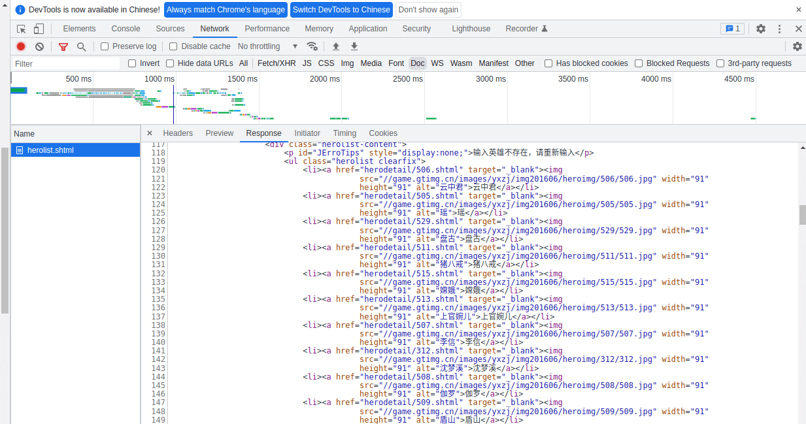

拼接li标签下对应的链接(https://pvp.qq.com/web201605/ + herodetail/***.html)，就可以访问到指定英雄对应的链接，如下所示：

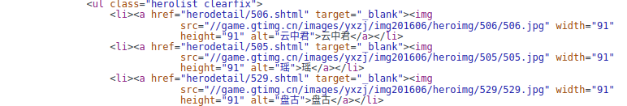

拼接的URL和访问的页面如下所示：

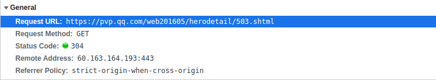

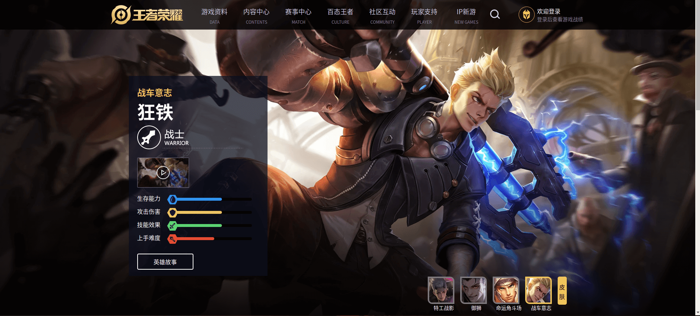

然后就可以愉快的获取信息了！

#### 初步挖掘

只须使用如下第三方库：

```python
import requests
from bs4 import BeautifulSoup
import re
```

之后编写代码的流程也很清晰明了，先通过主页面获取所以英雄的名称及其对应的链接，因为该网页使用了GBK编码，所以要进行转码。

代码如下：

```python
herolist = []
hero_dictionary = {}
result = []

root_url = "https://pvp.qq.com/web201605/"
herolist_url = root_url + "herolist.shtml"
headers = {'user-agent': 'Mozilla/5.0 (X11; Linux x86_64)'}


def get_herolist():
    res = requests.get(url=herolist_url, headers=headers)
    soup = BeautifulSoup(res.content.decode("gbk"), "html.parser") # GBK编码
    targets = soup.find(class_="herolist clearfix").find_all("a")
    for target in targets:
        name = target.text
        link = root_url + target["href"]
        print(name, link)
        herolist.append((name, link))

get_herolist()
```

运行结果如下：


下面访问单个英雄的链接，理清HTML结构后就可以获取数据。

英雄的称号在h3标签中：


英雄的属性在class="cover-list"的标签中，每个属性的信息在li标签中，每个属性的值其实就是横条的长度。

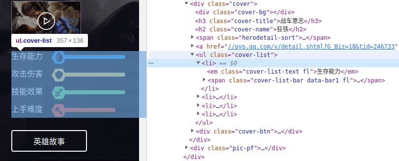

这个值可以在li标签下的i标签中找到，只要取出style的值即可，这是一个百分数字符串，取这个字符串中":"和"%"之间的字符串，得到一个数字，这个数字就可以代表属性值的大小。

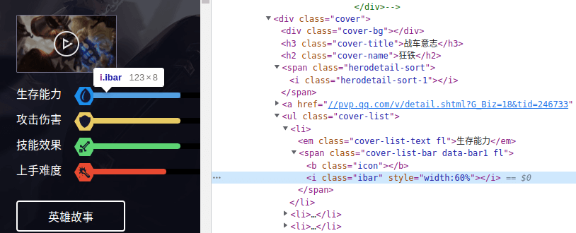

英雄的职业虽然没有以文本的形式显示出来，但如下`i`标签中的class值明显是和职业有关的：

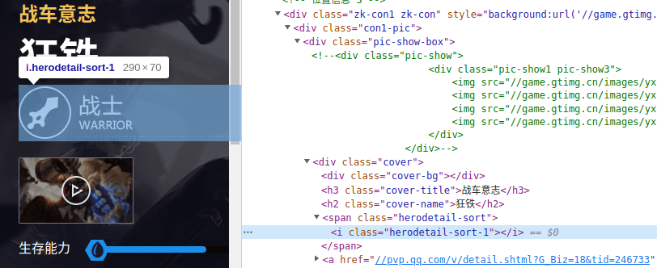

只要看看其他的英雄的页面，就可以得到如下对应关系：

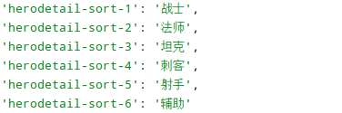

于是这部分代码就可以这样写：

```python
def get_heroinfo():
    professions = {'herodetail-sort-1': '战士',
                   'herodetail-sort-2': '法师',
                   'herodetail-sort-3': '坦克',
                   'herodetail-sort-4': '刺客',
                   'herodetail-sort-5': '射手',
                   'herodetail-sort-6': '辅助'
                   }
    for item in herolist:
        name,hero_url = item
        res = requests.get(url=hero_url, headers=headers)
        soup = BeautifulSoup(res.content.decode("gbk"), "html.parser")
        title = soup.find("h3").text  # 英雄称号
        profession = professions[soup.find(class_="herodetail-sort").find("i")["class"][0]]  # 英雄职业
        targets = soup.find(class_="cover-list").find_all("li")
        values = [re.search(r":([0-9]+%)", target.find("i")['style']).group()[1:-1] for target in targets]  # 英雄能力值
        print(title, name, profession, values)
```

运行结果：

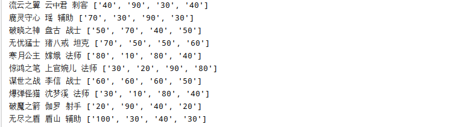

现在来解释这部分代码：

首先定义了一个字典来存放英雄职业对应关系，然后遍历上一段代码获取到的列表，取出每个元素中的链接，进行访问。

对每个链接再做一次请求，获取HTML文档后，借助标签进行数据提取，只要按照上文中说明的流程即可。我这里选择将属性值封装进一个列表。

我还想获得英雄关系，能便于我在选英雄时具有针对性...


观察HTML代码，可以看到3大关系都放在如下3个标签中：

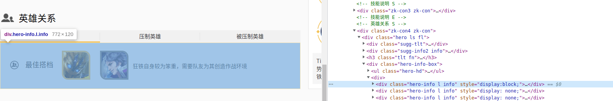

一个关系中有两个英雄，分别放在li标签下，而a标签下存放的路径，就指向了这个英雄：

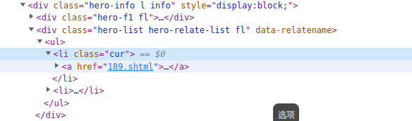

那么依据这个链接，就可以得到这个英雄：

这里我选择在最开始获取英雄链接的函数里，加上一个建立字典的操作，这个字典的键就是路径(被分割过)，值是英雄名：

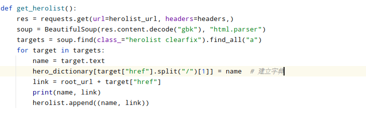

建立字典的目的是便于索引，可以直接通过路径拿到英雄名称：

```python
        relations = []
        # 获取英雄关系
        targets = soup.find_all(class_="hero-list hero-relate-list fl")
        for target in targets:
            temp = target.find_all("a")
            hero_one = hero_dictionary[temp[0]["href"]]
            hero_two = hero_dictionary[temp[1]["href"]]
            relations.append(hero_one+"/"+hero_two)
```

用一个列表来存放这三个关系。

于是整个代码变成了这个样子：

```python
import requests
from bs4 import BeautifulSoup


herolist = []
hero_dictionary = {}
root_url = "https://pvp.qq.com/web201605/"
herolist_url = root_url + "herolist.shtml"
headers = {'user-agent': 'Mozilla/5.0 (X11; Linux x86_64)'}


def get_herolist():
    res = requests.get(url=herolist_url, headers=headers,)
    soup = BeautifulSoup(res.content.decode("gbk"), "html.parser")
    targets = soup.find(class_="herolist clearfix").find_all("a")
    for target in targets:
        name = target.text
        hero_dictionary[target["href"].split("/")[1]] = name  # 建立字典
        link = root_url + target["href"]
        print(name, link)
        herolist.append((name, link))


def get_heroinfo():
    professions = {'herodetail-sort-1': '战士',
                   'herodetail-sort-2': '法师',
                   'herodetail-sort-3': '坦克',
                   'herodetail-sort-4': '刺客',
                   'herodetail-sort-5': '射手',
                   'herodetail-sort-6': '辅助'
                   }
    for item in herolist:
        name,hero_url = item
        res = requests.get(url=hero_url, headers=headers)
        soup = BeautifulSoup(res.content.decode("gbk"), "html.parser")
        title = soup.find("h3").text  # 英雄称号
        profession = professions[soup.find(class_="herodetail-sort").find("i")["class"][0]]  # 英雄职业
        targets = soup.find(class_="cover-list").find_all("li")
        values = [re.search(r":([0-9]+%)", target.find("i")['style']).group()[1:-1] for target in targets]  # 英雄能力值

        print(name)
        relations = [] # 关系列表
        # 获取英雄关系
        targets = soup.find_all(class_="hero-list hero-relate-list fl")
        for target in targets:
            temp = target.find_all("a")
            hero_one = hero_dictionary[temp[0]["href"]]
            hero_two = hero_dictionary[temp[1]["href"]]
            relations.append(hero_one+"/"+hero_two)

        print(title, name, profession, values, relations)


get_herolist()
get_heroinfo()
```

运行起来可以发现，刚开始很正常，顺利获取了数据：

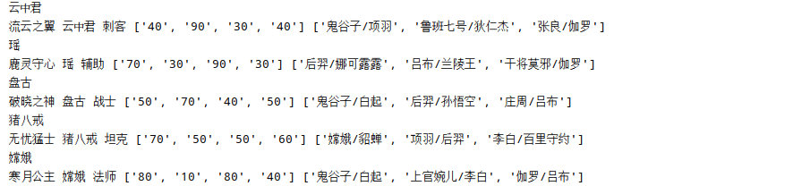

但到后面就报错了，显示`KeyError`：

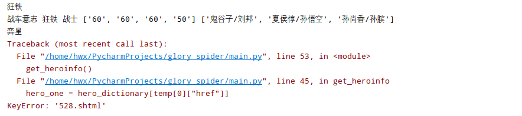

这是因为字典中没有这个键，这说明了什么？

说明了最开始爬到的诸多英雄，是有缺失的。访问一下这个528.shtml对应的页面：

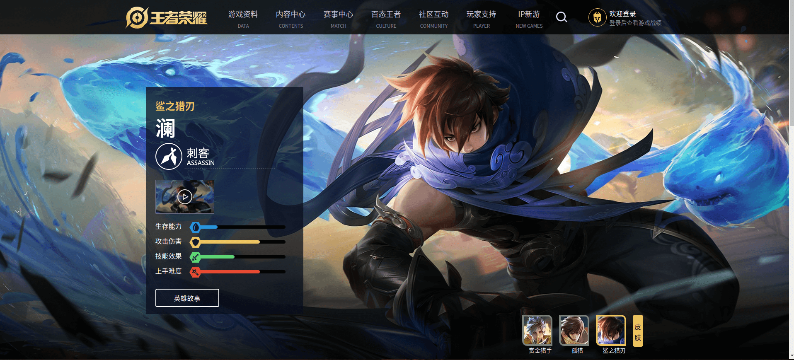

再后头检查一下爬到的英雄，发现真的没有澜...

感觉有点无语，但毕竟已经是个到这一步了，容我冷静地想一想为什么...

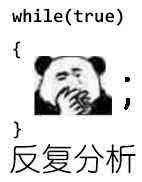

#### 反思问题

不难发现，这个链接返回的数据，原本就是缺的：


前面的这部分数据，明显找不到。

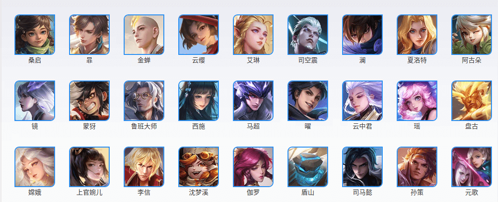

再看看这让人匪夷所思的URL，搞不好数据还是停留在2016年的...

再看看请求头，发现status code是304并非200，可见发生了网页重定向：

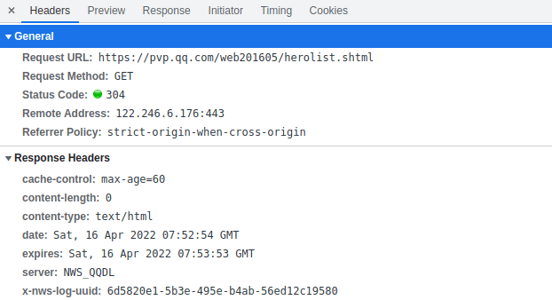

就不详细解释304的意思了，直接百度 [分析HTTP请求返回304状态码 - 百度文库](https://wenku.baidu.com/view/97ccaaa6d7d8d15abe23482fb4daa58da0111ca5.html)。

遇到这种问题并非没有解决方法，但我就不继续挖坑了，因为我更乐意另辟蹊径。

在XHR中发现了一条请求，返回的是json数据。

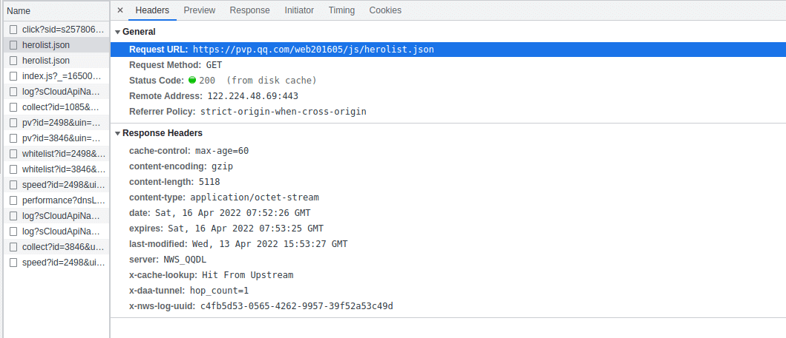

不妨看看这是个甚么数据：

```python
import requests

hero_dict = dict()
hero_list = list()
url = "https://pvp.qq.com/web201605/js/herolist.json"
headers = {'user-agent': 'Mozilla/5.0 (X11; Linux x86_64)'}
results = requests.get(url=url,headers=headers).json()
for result in results:
    print(result)
```

看到这个数据，检验了一下，发现是齐全的，不禁觉得惊喜又感动，但又有那么一丝惆怅。

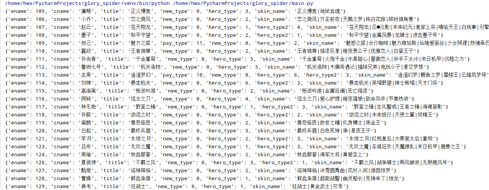

之前以为静态网页就是软柿子了，但现在这个json数据似乎更加简明。所以说，我们不能局限在经验里。

#### 改善代码

现在只要将第一个获取英雄列表的函数替换：

```python
def get_herolist():
    url = "https://pvp.qq.com/web201605/js/herolist.json"
    results = requests.get(url=url, headers=headers).json()
    for result in results:
        name = result["cname"] # 英雄名称
        link = "https://pvp.qq.com/web201605/herodetail/{}.shtml".format(result["ename"])
        herolist.append((name,link))
        hero_dictionary["{}.shtml".format(result["ename"])] = name
```

在稍微修改一下后面的代码，目前得到的代码是这样的：

```python
import requests
from bs4 import BeautifulSoup
import re

herolist = []
hero_dictionary = {}
result_list = []
root_url = "https://pvp.qq.com/web201605/"
herolist_url = root_url + "herolist.shtml"
headers = {'user-agent': 'Mozilla/5.0 (X11; Linux x86_64)'}


def get_herolist():
    url = "https://pvp.qq.com/web201605/js/herolist.json"
    results = requests.get(url=url, headers=headers).json()
    for result in results:
        name = result["cname"] # 英雄名称
        link = "https://pvp.qq.com/web201605/herodetail/{}.shtml".format(result["ename"])
        herolist.append((name,link))
        hero_dictionary["{}.shtml".format(result["ename"])] = name


def get_heroinfo():
    professions = {'herodetail-sort-1': '战士',
                   'herodetail-sort-2': '法师',
                   'herodetail-sort-3': '坦克',
                   'herodetail-sort-4': '刺客',
                   'herodetail-sort-5': '射手',
                   'herodetail-sort-6': '辅助'
                   }
    for item in herolist:
        name,hero_url = item
        res = requests.get(url=hero_url, headers=headers)
        soup = BeautifulSoup(res.content.decode("gbk"), "html.parser")
        title = soup.find("h3").text  # 英雄称号
        profession = professions[soup.find(class_="herodetail-sort").find("i")["class"][0]]  # 英雄职业
        targets = soup.find(class_="cover-list").find_all("li")
        values = [re.search(r":([0-9]+%)", target.find("i")['style']).group()[1:-1] for target in targets]  # 英雄能力值
        relations = []
        # 获取英雄关系
        targets = soup.find_all(class_="hero-list hero-relate-list fl")
        for target in targets:
            temp = target.find_all("a")
            hero_one = hero_dictionary[temp[0]["href"]]
            hero_two = hero_dictionary[temp[1]["href"]]
            relations.append(hero_one+"/"+hero_two)

        print(title, name, profession, values, relations, hero_url)


get_herolist()
get_heroinfo()
```

运行结果如下：

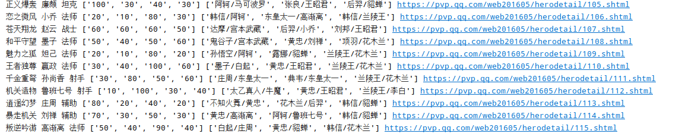

事实上数据还可以进一步扩充，这就看自己的意愿了。

#### 数据存储

下面实现将数据保存到excel。

一个Excel文档也称为一个工作簿（workbook），每个工作簿里可以有多个工作表（worksheet），当前打开的工作表又叫活动表。

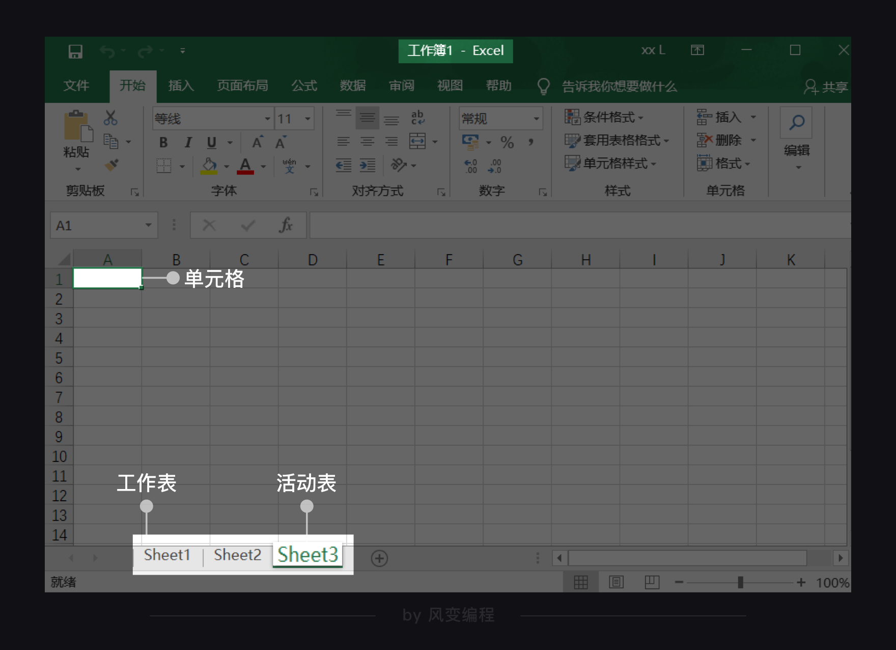

每个工作表里有行和列，特定的行与列相交的方格称为单元格（cell）。比如上图第A列和第1行相交的方格可以直接表示为A1单元格。

通过openpyxl.Workbook()函数就可以创建新的工作簿。

创建完新的工作簿后，还得获取工作表。不然程序会无所适从，不知道要把内容写入哪张工作表里。

添加完工作表，就能来操作单元格，往单元格里写入内容。

使用append函数，就可以添加一行。

代码如下：

```python
def save_excel():
    wb = openpyxl.Workbook()
    sheet = wb.active
    sheet.title = "sheet1"
    # 表头
    head = ["英雄称号", "英雄名称", "英雄职业", "生存能力", "攻击伤害", "技能效果", "上手难度", "最佳搭档", "压制英雄", "被压制英雄", "链接"]
    sheet.append(head)
    for item in result_list:
        # 将数据整合为一维列表便于添加
        row = list()
        row.append(item[0])
        row.append(item[1])
        row.append(item[2])
        for value in item[3]:
            row.append(value)
        for group in item[4]:
            row.append(group)
        row.append(item[5])
        sheet.append(row) # 整行添加

    wb.save('result.xlsx')
```

如下就是最后的结果了

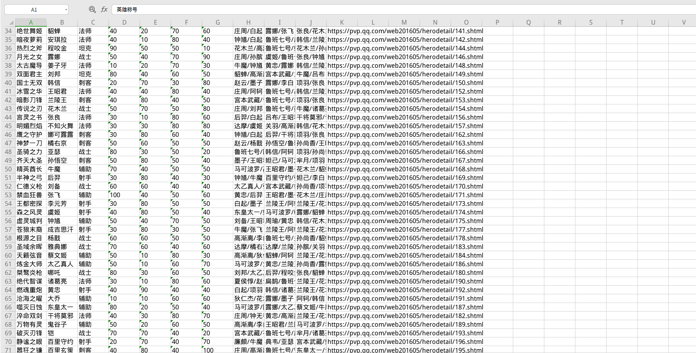

接着又试着获取了所有装备的信息，就不详细描述了。

```python
def get_equiplist():
    type_list = ["攻击", "法术", "防御", "移动", "打野", "", "游走"]
    url = "https://pvp.qq.com/web201605/js/item.json"
    items = requests.get(url=url, headers=headers).json()
    for item in items:
        name = item["item_name"]
        item_type = item["item_type"]
        price = item["price"]
        total_price = item["total_price"]
        attribute = item["des1"].strip("<p>").strip("</p>").replace("<br>", "")
        try:
            ability = item["des2"].strip("<p>").strip("</p>").replace("<br>", "")
        except KeyError:
            ability = ""
        equip_list.append([name, type_list[item_type-1], price, total_price, attribute, ability])
```

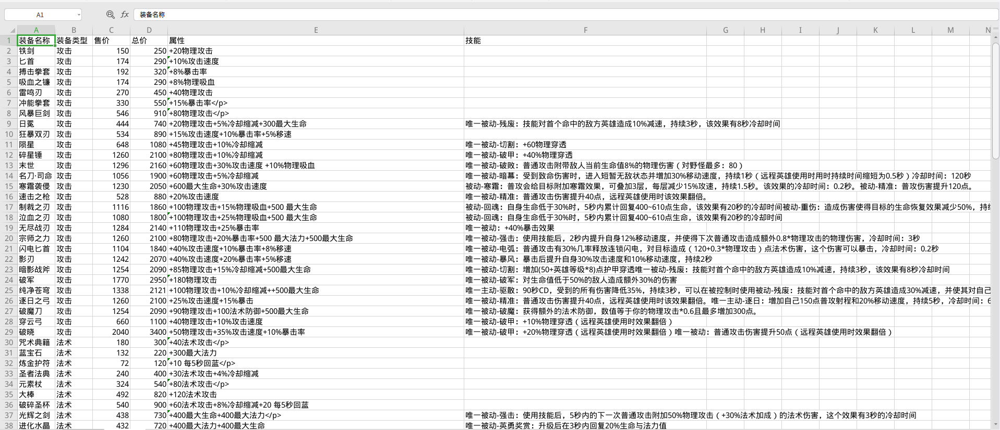

最后的完整代码：

```python
import requests
from bs4 import BeautifulSoup
import openpyxl
import re

herolist = []
hero_dictionary = {}
equip_list = []
result_list = []
root_url = "https://pvp.qq.com/web201605/"
herolist_url = root_url + "herolist.shtml"
headers = {'user-agent': 'Mozilla/5.0 (X11; Linux x86_64)'}


def get_herolist():
    url = "https://pvp.qq.com/web201605/js/herolist.json"
    results = requests.get(url=url, headers=headers).json()
    for result in results:
        name = result["cname"] # 英雄名称
        link = "https://pvp.qq.com/web201605/herodetail/{}.shtml".format(result["ename"])
        herolist.append((name,link))
        hero_dictionary["{}.shtml".format(result["ename"])] = name


def get_heroinfo():
    professions = {'herodetail-sort-1': '战士',
                   'herodetail-sort-2': '法师',
                   'herodetail-sort-3': '坦克',
                   'herodetail-sort-4': '刺客',
                   'herodetail-sort-5': '射手',
                   'herodetail-sort-6': '辅助'
                   }
    for item in herolist:
        name,hero_url = item
        res = requests.get(url=hero_url, headers=headers)
        soup = BeautifulSoup(res.content.decode("gbk"), "html.parser")
        title = soup.find("h3").text  # 英雄称号
        profession = professions[soup.find(class_="herodetail-sort").find("i")["class"][0]]  # 英雄职业
        targets = soup.find(class_="cover-list").find_all("li")
        values = [re.search(r":([0-9]+%)", target.find("i")['style']).group()[1:-1] for target in targets]  # 英雄能力值
        relations = []
        # 获取英雄关系
        targets = soup.find_all(class_="hero-list hero-relate-list fl")
        for target in targets:
            temp = target.find_all("a")
            hero_one = hero_dictionary[temp[0]["href"]]
            hero_two = hero_dictionary[temp[1]["href"]]
            relations.append(hero_one+"/"+hero_two)

        print(title, name, values, hero_url)
        result_list.append((title, name, profession, values, relations, hero_url))


def get_equiplist():
    type_list = ["攻击", "法术", "防御", "移动", "打野", "", "游走"]
    url = "https://pvp.qq.com/web201605/js/item.json"
    items = requests.get(url=url, headers=headers).json()
    for item in items:
        name = item["item_name"]
        item_type = item["item_type"]
        price = item["price"]
        total_price = item["total_price"]
        attribute = item["des1"].strip("<p>").strip("</p>").replace("<br>", "")
        try:
            ability = item["des2"].strip("<p>").strip("</p>").replace("<br>", "")
        except KeyError:
            ability = ""
        equip_list.append([name, type_list[item_type-1], price, total_price, attribute, ability])


def save_excel():
    wb = openpyxl.Workbook()
    sheet = wb.active
    sheet.title = "英雄大全"
    head = ["英雄称号", "英雄名称", "英雄职业", "生存能力", "攻击伤害", "技能效果", "上手难度", "最佳搭档", "压制英雄", "被压制英雄", "链接"]
    sheet.append(head)
    for item in result_list:
        row = list()
        row.append(item[0])
        row.append(item[1])
        row.append(item[2])
        for value in item[3]:
            row.append(value)
        for group in item[4]:
            row.append(group)
        row.append(item[5])
        sheet.append(row)

    sheet = wb.create_sheet("装备大全", 1)
    head = ["装备名称", "装备类型", "售价", "总价", "属性", "技能"]
    sheet.append(head)
    for item in equip_list:
        sheet.append(item)

    wb.save('result.xlsx')
    wb.close()


if __name__ == '__main__':
    get_herolist()
    get_heroinfo()
    get_equiplist()
    save_excel()
```

