# 逆向工程实战

## 破解软件序列号

这一部分主要讲述破解《加密与解密》一书中一个带有序列号保护机制的程序。

调试工具: OllyDBG(吾爱破解专版)

操作系统: Windows 10

### 观察功能

首先点击软件运行：

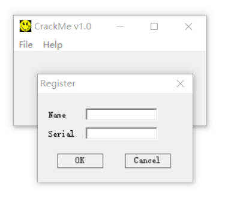

弹出注册对话框，向输入框随便输入一些字符：

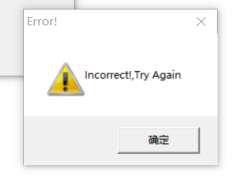

程序弹窗，报出输入错误。

### 初步调试

在此之前，书中给出了一些提示信息，本程序采用非对等函数检查序列号，用户名是纯英文字符串，序列号是纯数字。

如果输入的用户名和序列号满足 F1(用户名)=F2(序列号) ，则认为是正确的序列号。

采用这种方法，可以使内存中不出现明码。

现在使用OllyDBG调试该程序：

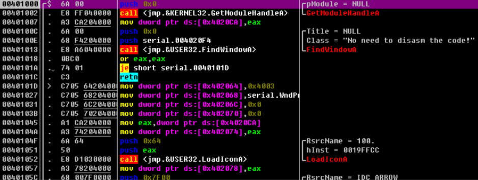

在程序的开头可以看见一些win32窗口程序的启动代码。

例如`RegisterClass`和`CreateWindow`函数都是一些创建窗口的必要操作，但这些并非是关注的重点：

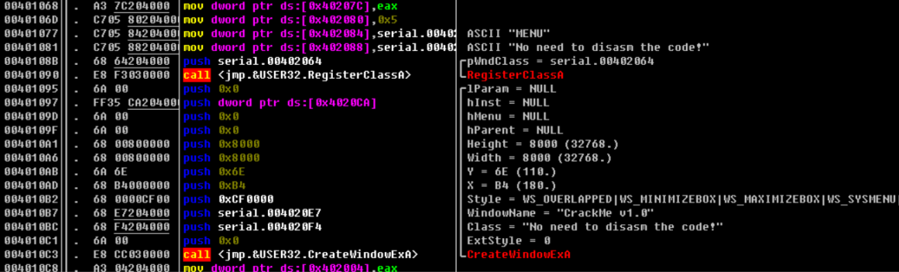

现在右击界面->**search for**->**All referenced strings text** 查看字符串列表：

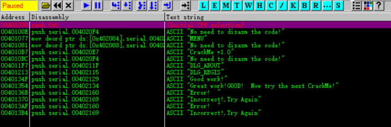

可以看到一些字符串信息。

双击其中"Incorrect! Try again"字符串，就可以来到对应代码处：

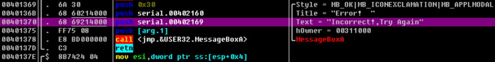

观察代码可知，这里的操作是弹窗，调用`MessageBox`函数，告知用户输入错误，在此处打上断点。

按F9，执行到底，可以发现窗口被完全显示了出来，现在再点开注册对话框，向name输入"test"，向序列号输入"123456"：

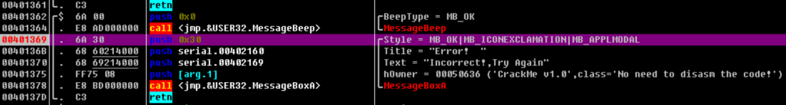

程序停在了断点处，此时再打开字符串列表：

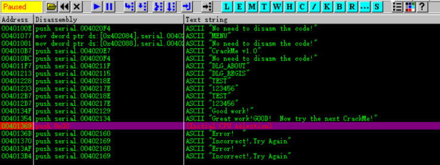

现在可以找到刚刚输入的内容，双击查看：

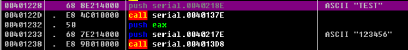

不难推测，这两个push字符串的操作紧跟着的两个call分别都调用了各自的转换函数，即上文提到的F和F2，在这两个地方下断点。

`Ctrl+F2`重启程序，按F9后点开注册对话框，输入和之前一样的字符，运行到断点处：

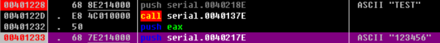

继续往下执行，之后可以发现运行下面高亮处代码后就会报出错误窗口：

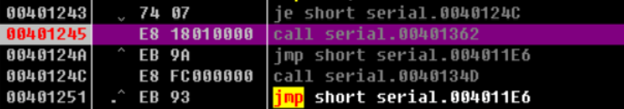

实际上是跳转到了下方的代码，之前提到的调用了`MessageBox`的位置：

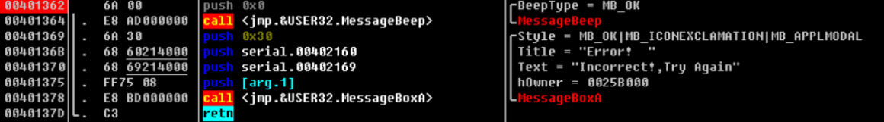

重启程序，查看刚刚的位置：

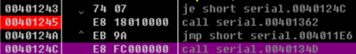

`je`指令显然是个条件判断，可以推测这里是在判断结果正确性，如果不正确则不跳转，往下执行，之后弹窗。

那就将`je`修改一下即可，将高亮行放在`je`指令上，按空格键：

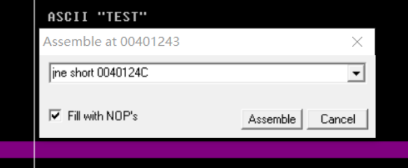

修改完毕，继续执行：

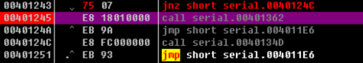

运行到此处：

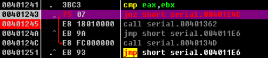

程序完美地越过了上一个call，没有引发报错弹窗：

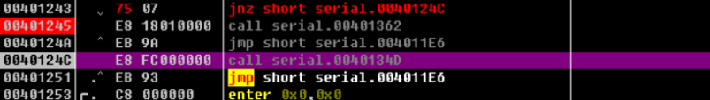

**破解成功**！

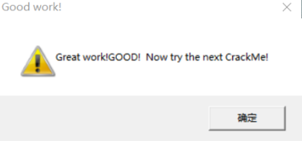

实际上这段程序是执行到了下面的代码位置：

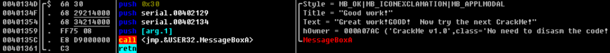

### 算法逆向

现在来尝试还原两个加密函数，现在回车进入第一个加密函数F1(call 0040137E处)：

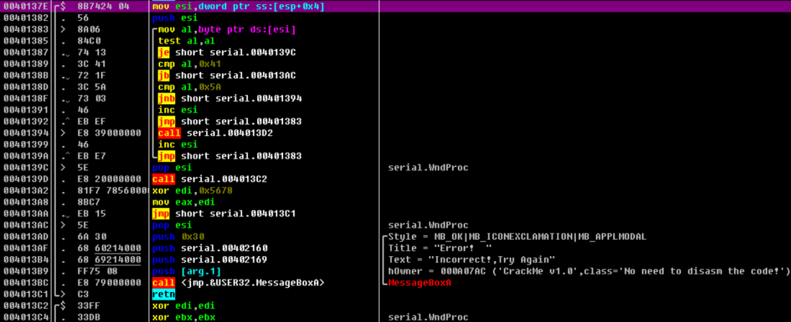

第一句代码是将esp+0x4地址处的数据放入寄存器，显然这是压入栈的字符串"test"的首地址，在后续的一系列操作结束后，会将这个值再从栈取出，来指向字符串首地址。

`push esi`是将esi寄存器的值入栈，mov指令是取字符串中的 1 个字节，test al,al是判断是否为 0 ，实际上是在判断是否到了字符串的末尾：

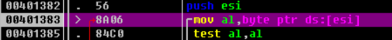

如果到了末尾，那么test指令就会修改标志寄存器对应的比特位，下一行的je指令就会被执行，直接跳转到其他地方。

如果没有到末尾，那么这一句指令不会被执行，而是继续顺序往下执行。cmp al,0x41的作用是比较，在上面的操作中，al已经存入了字符串中的 1 个字节，那么这一步操作实际上是在比较字符ASCII值的大小，配合jb指令可以判断是否为字母，如果不是字母则跳转到004013AC，这个地址就是弹出错误窗口的代码处：

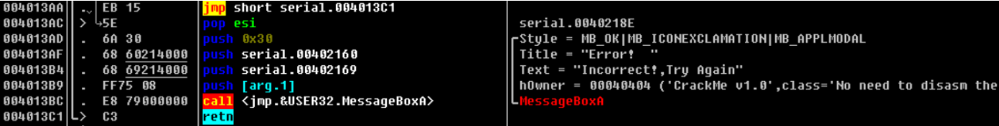

同理`cmp al,0x5A`是和字母Z比较，配合`jnb`指令，判断是否为小写字母，如果是小写字母，则跳到00401394 ，执行call 004013D2，查看004013D2处代码：

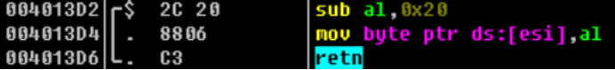

`sub al,0x20`是将al中的值减去0x20，实际上是将ACII码减去0x20，目的是将小写字母转换为大写字母，然后再将结果放到原来的地址[esi]中。

`inc esi`，是将esi中的值自加 1 ，在代码中的目的是指向字符串中的下一个字符，可以当成一个“指针”，转换大小写后同样要将esi加 1 以指向下一个字符，因此这里有两处`inc esi`。

下一个`jmp`指令是回跳到前面的代码地址，显然这是在循环中。那么这个循环的退出条件显然是上文提到的字符串中的字符全被取完。

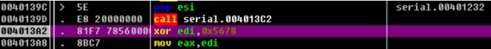

循环过后，`pop esi`的目的是重新指向字符串首地址，将最初压入栈的esi+0x4地址处的值放入esi。

现在重新指向字符串首地址后，又执行了call 004013C2，现在查看对应代码：

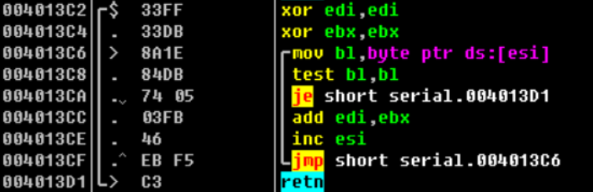

`xor edi,edi`是清 0 操作，数字和自己做异或运算结果是 0 ，同样`xor ebx,ebx`也是清 0。

下面的`mov`操作和上文提到过的一样，是取一个字符，`je`同样是条件判断，结合下面的`inc`指令和`jmp`指令来看，循环取出 1 个字符进行操作，当字符取完则跳到`retn`指令。

未取完字符时，执行add edi,ebx。

bl存储的数据是ebx寄存器中数据的低 8 位，或者说是ebx的低字节(ebx的高 8 位是bh,低 8 位是bl)，现在ebx的高 8 位都是 0 ，那么实际上ebx存储的就是字符的值。因为add指令要求所操作的寄存器宽度一样，所以不能直接拿bl进行运算。

那么这一步add的操作就是将字符的值加到edi里，整个代码的作用是循环将用户输入的字符的值加到一个变量里。

函数结束后，edi中保存的就是所以字符值的和，`xor edi,0x5678`就是将这个和与0x5678做异或运算。

那么到这里，整个函数已经很清晰了。这个函数在做的操作是循环取出整个字符串的每个字符，如果不是字母则报错，如果是小写字母则减0x20转成大写字母，同时将这些字符的值求和，与0x5678异或。

现在可以轻松写出对应的C语言代码：

```c
int F1(char *name) {
  int i, k1 = 0;
  char ch;
  for (i = 0; name[i] != 0; i++) {
    ch = name[i];
    if (ch < 'A')
      break;
    if (ch > 'Z')
      ch -= 0x20;
    k1 += ch;
  }
  k1 ^= 0x5678;
  return k1;
}
```

下面就看F2的代码：

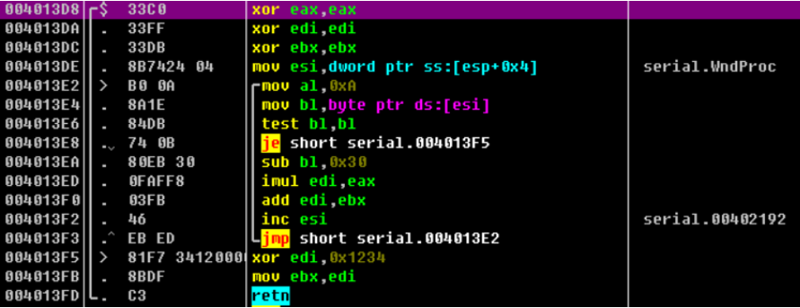

前 3 步`xor`都是将寄存器清 0 ，下面的`mov`是取出字符串首地址放入esi，esi作为指针指向字符串首地址。

`mov al,0xA`将eax的值设置为0xA，紧接着的`mov bl`,...、`test bl,bl` 和`je` ... 是从字符串取出一个字符和判0 。

sub b1,0x30是将寄存器中的值减去0x30，即是将字符的值减去0x30，`imul edi,eax`是将edi和eax作乘法，这里eax已经赋值为 10 了，因此这条指令等价于edi = edi * 10。

其后的add指令是将edi的值与ebx的值相加。

这几条语句连贯起来看，其实就是 edi = (edi*10) + (字符-0x30)，循环这个操作。整个循环结束后将edi的值与0x1234异或，放入ebx作为返回值。

分析后，可以很轻松还原出下列代码：

```c
int F2(char *code) {
  int i, k2 = 0;
  for (i = 0; code[i] != 0; i++) {
    k2 += k2 * 10 + code[i] - 0x30;
  }
  k2 ^= 0x1234;
  return k2;
}
```

从上述代码不难看出，代码中的循环实际上是将数字字符串转化为int型纯数字("123456"->123456)。

现在只要上述两个函数的返回k1与k2相等，即可注册成功。

编写注册机时要对函数F1或F2进行逆变换，如果不能就只能穷举了。

异或运算是可以求逆的，还有这里有个小细节要注意：

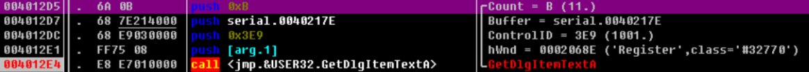

观察`GetDlgItemTextA`的参数可知，该函数只读入11(0xB)个字符，末尾的 0 用去 1 个，那么实际的name字符串只有10个字符。

下面是完整的注册机代码:


```c
#include <stdio.h>
int keygen(char *name) {
  int i, k1 = 0, k2 = 0;
  char ch;
  for (i = 0; name[i] != 0 && i <= 9; i++) {
    ch = name[i];
    if (ch < 'A')
      break;
    if (ch > 'Z')
      ch -= 0x20;
    k1 += ch;
  }
  k2 = k1 ^ 0x5678 ^ 0x1234;
  return k2;
}
int main(void) {
  char name[11] = {0};
  printf("input name: ");
  scanf_s("%s", name, 11);
  printf("%d", keygen(name));
  return 0;
}
```
输入该注册码，注册成功！

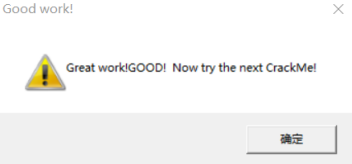

## 解除软件使用时限

这一部分主要讲述对《加密与解密》一书中一个带有时间限制的程序的破解。

开发工具: Visual Studio 2019。

### 前置知识

时间限制程序有两类，一类是限制每次运行的时长，另一类是每次运行时长不限，但是有时间限制，例如 30 天、 14 天、 7 天等。

#### 计时器

有一类程序，每次运行时都有时间限制，例如运行 10 分钟或者 20 分钟就停止，必须重新运行程序才可正常工作。

这类程序里有一个计时器来统计程序运行的时间。在Windows系统中，有如下选择可以实现一个计时器。

#### SetTimer函数

微软官方文档中函数原型如下:

```c
UINT_PTR SetTimer(
    [ in, optional ] HWND hWnd, [in] UINT_PTR nIDEvent, [in] UINT uElapse,
    [ in, optional ] TIMERPROC lpTimerFunc);
```

- `hWnd` ：窗口句柄，若计时器到时，系统会向这个窗口发送`WM_TIMER`消息；
- `nIDEvent` ：计时器标识；
- `uElapse` ：指定计时器时间间隔；
- `TIMEPROC` ：回调函数。若计时器超时，系统将调用这个函数。如果为NULL，若计时器超时，将向相应的窗口发送`WM_TIMER`消息。

应用程序可在初始化时调用这个API函数，向系统申请一个计时器并指定计时器的时间间隔，同时获得一个处理计时器超时的回调函数。

若计时器超时，系统会向申请该计时器的窗口过程发送消息`WM_TIMER`，或者调用程序提供的回调函数。

`SetTimer`函数是以Windows消息的方式工作的，精度受到了一定的限制。

当程序不需要计时器时，可以调用`KillTimer`函数来销毁。

下面直接通过程序来演示：

```c
#include "stdio.h"
#include "windows.h"

LRESULT CALLBACK MainWndProc(HWND, UINT, WPARAM, LPARAM); // 窗口回调函数
void CALLBACK TimeProc(HWND, UINT, UINT, DWORD);
int APIENTRY WinMain(HINSTANCE hInstance, HINSTANCE hPrevInstance,
                     LPSTR szCmdLine, int nCmdShow) {
  char szClassName[] = "MainWClass";
  //定义窗口类
  WNDCLASSEX wndclass = {0};
  //窗口类大小
  wndclass.cbSize = sizeof(wndclass);
  //纵横向重画
  wndclass.style = CS_HREDRAW | CS_VREDRAW;
  //绑定回调函数
  wndclass.lpfnWndProc = MainWndProc;
  //绑定实例句柄
  wndclass.hInstance = hInstance;
  //加载默认图标
  wndclass.hIcon = ::LoadIcon(NULL, IDI_APPLICATION);
  //加载默认光标
  wndclass.hCursor = ::LoadCursor(NULL, IDC_ARROW);
  //加载背景 白色画刷
  wndclass.hbrBackground = (HBRUSH)::GetStockObject(WHITE_BRUSH);
  wndclass.lpszClassName = szClassName;
  //向系统内核注册窗口类
  ::RegisterClassEx(&wndclass);
  //创建主窗口
  HWND hWnd = ::CreateWindowEx(0,
                               szClassName, //类名
                               "win32 窗口程序", WS_OVERLAPPEDWINDOW,
                               CW_USEDEFAULT, CW_USEDEFAULT, CW_USEDEFAULT,
                               CW_USEDEFAULT, NULL, NULL, hInstance, NULL);
  SetTimer(NULL, 1, 1000, TimeProc); // 设定计时器
  //错误处理
  if (NULL == hWnd) {
    ::MessageBox(NULL, "Create Window failed", "ERROR", MB_OK);
    return -1;
  }
  //显示窗口
  ::ShowWindow(hWnd, nCmdShow);
  ::UpdateWindow(hWnd);
  //从操作系统的消息队列中不断检索消息
  MSG msg;
  while (::GetMessage(&msg, NULL, 0, 0)) {
    ::TranslateMessage(&msg); //翻译消息
    ::DispatchMessage(&msg);  //派发消息
  }
  return msg.wParam;
}
LRESULT CALLBACK MainWndProc(HWND hWnd, UINT message, WPARAM wParam,
                             LPARAM lParam) {
  switch (message) {
  case WM_DESTROY:
    PostQuitMessage(0);
    return 0;
  }
  //剩下的交给系统默认处理
  return ::DefWindowProc(hWnd, message, wParam, lParam);
}
void CALLBACK TimeProc(HWND hWnd, UINT uMsg, UINT idEvent, DWORD dwTime) {
  SYSTEMTIME time;
  GetSystemTime(&time);
  CHAR szTime[255] = {0};
  sprintf_s(szTime, "%d-%d-%d-%d:%d:%d", time.wYear, time.wMonth, time.wDay + 8,
            time.wHour, time.wMinute, time.wSecond);
  MessageBox(NULL, szTime, "系统时间", 0);
}
```

上述代码创建了一个窗口和一个计时器，设置visual studio链接器的子系统为窗口：

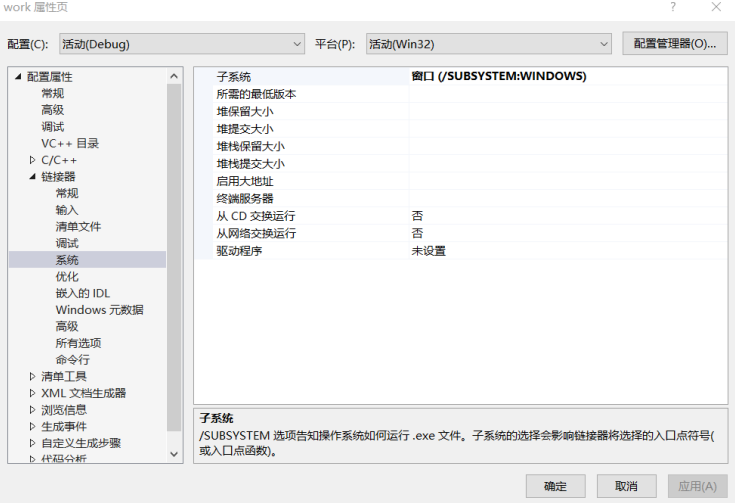

运行程序：

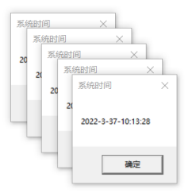


运行结果上所示，定时器每 1 秒弹出一个窗口。

#### 高精度多媒体计时器

多媒体计时器的精度可以达到 1 毫秒，应用程序可以通过调用TimeSetEvent函数来启动一个多媒体计时器。

```c
MMRESULT timeSetEvent(UINT uDelay, UINT uResolution, LPTIMECALLBACK lpTimeProc,
                      DWORD_PTR dwUser, UINT fuEvent);
```

#### GetTickCount函数

Windows提供了API函数GetTickCount()，该函数返回的是系统自成功启动以来所经过的时间(以毫秒为

单位)。将该函数的两次返回值相减，就能知道程序已经运行了多久，这个函数的精度取决于系统的设

置。

#### timeGetTime函数

多媒体计时器函数timeGetTime也可以返回windows自启动后所经过的时间(以毫秒为单位)

### 拆解时间限制保护

打开实例程序：

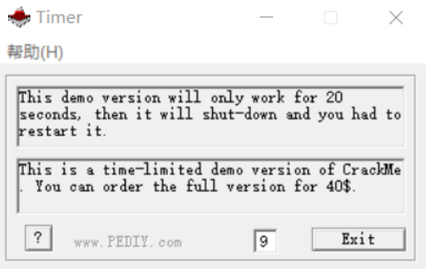

只要下方的计时器走到 20 ，程序就会自动退出。

书中提示这个程序使用了`SetTimer`函数，将其放入OllyDBG进行调试：

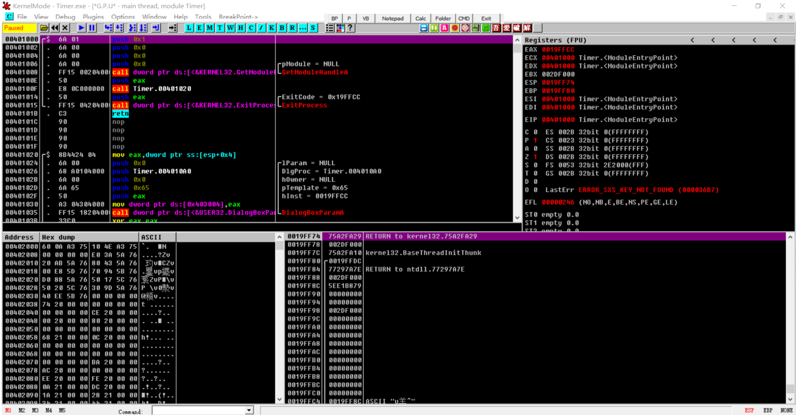

右击界面-> **search for**-> **All intermodular calls** 打开调用API列表：

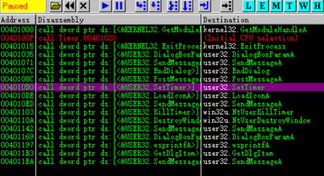

双击此处，来到对应代码处：

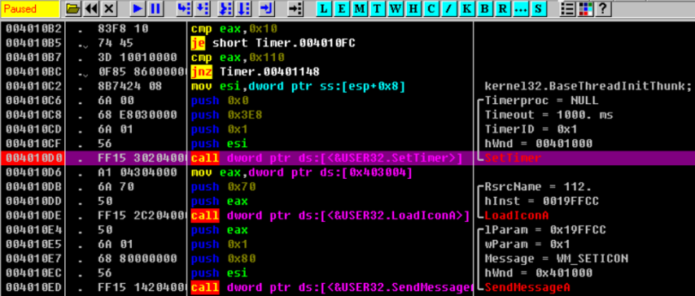

可以直接修改汇编代码，让程序跳过`call SetTimer`，如下所示：

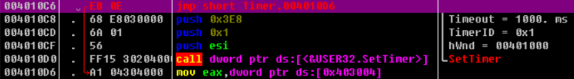

`jmp`指令使得执行流会越过`SetTimer`。

按F9直接运行，可以发现，下方的计时数字消失了，证明计时器已经成功被拆除：

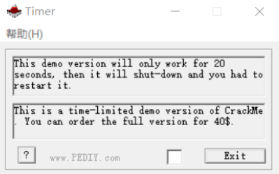

当然还有其他办法：

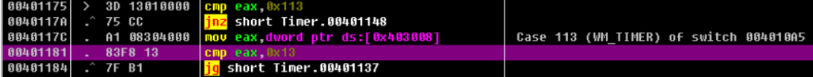

这里可以发现一个比较，实际上eax存取的是当前计时，超过0x13则跳到另一处代码，此处代码执行的是`SendMessage`函数，向窗口发送`WM_CLOSE`消息来关闭窗口：

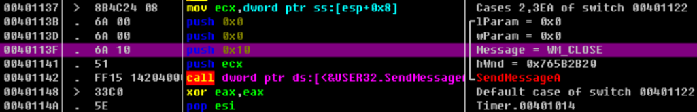

可以修改这里的代码，将跳转语句修改为nop：

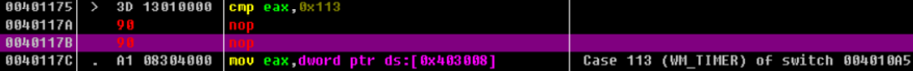

现在按F9，直接运行：

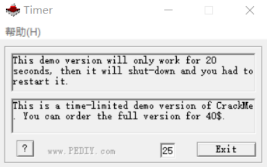

现在时间超出 20 也不会自行退出了。

### 扩展延伸

一般软件的时限保护如下:

在安装软件时，由安装程序取得当前系统日期，或者由主程序在软件第 1 次运行时获得系统日期，并将其记录在系统中某个地方(注册表、文件、扇区)。

这个时间统称是软件的安装日期。程序每次运行时都要取得当前系统日期，将其与之前记录的安装日期进行比较。

考虑周全的话，软件最少要保存两个时间值，一个时间值是上述说的安装时间，另一个是最近运行的时间。

用于获取时间的API函数有`GetSystemTime`、`GetLocalTime`和`GetFileTime`，调试时可以考虑在这些函数上下断点。

也可以利用`RegMon`、`FileMon`之类的软件进行监控，找到时间存放的位置。

## 突破菜单功能限制

> 实例来自看雪论坛的《加密与解密》。

### 前置介绍

这类程序一般是Demo版，其菜单或窗口中的部分选项是灰色的，无法使用。

这种功能受限的程序一般分两种：

1. 一种是试用版和正式版的软件是完全不同的两个版本，被禁止的功能在试用版中根本没有相应代码，这些代码只有正式版中才有，而正式版是无法免费下载的，只能向软件作者购买。
2. 另一种是使用版和正式版为同一个文件。没有注册时按照试用版运行，禁止用户使用某些功能；注册之后就以正式版运行，用户可以使用其全部功能。可见，被禁止的那些功能的程序代码其实是存在于程序之中的，解密者只要通过一定方法就能恢复被限制的功能。

**相关函数**：

如果要将软件菜单和窗口变灰(不可用状态)，可以使用如下函数：

```c
BOOL EnableMenuItem([in] HMENU hMenu, [in] UINT uIDEnableItem,
                    [in] UINT uEnable);
```

`hMenu`是菜单句柄，`uIDEnableItem`是允许或禁止的一个菜单条目的标识符，`uEnable`是控制标识。

```c
BOOL EnableWindow([in] HWND hWnd, [in] BOOL bEnable);
```

`hWnd`是窗口句柄，`hEnable`是控制标志。

### 调试软件

该软件一部分文字和按钮都被禁用：

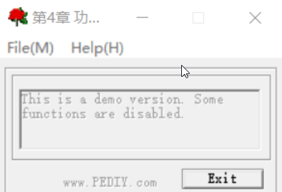

放入OllyDBG进行调试：

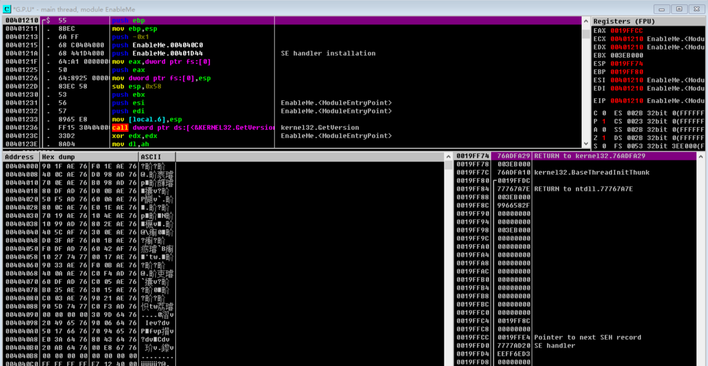

进入API列表：

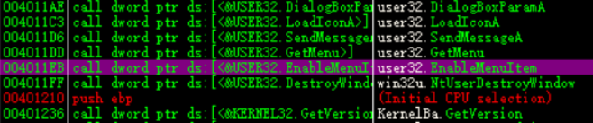

定位到该关键函数，双击进入对应代码处：

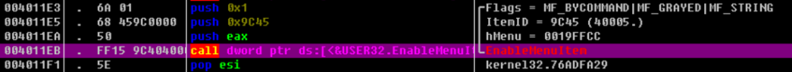

观察上方的`push`，可知传入该函数的参数。

将上方的`push 0x1`修改为`push 0x0`，实际上就是将标志设为 0 ，按`F9`直接运行，发现原本禁用的按钮已经可以使用，点击后弹出窗口：

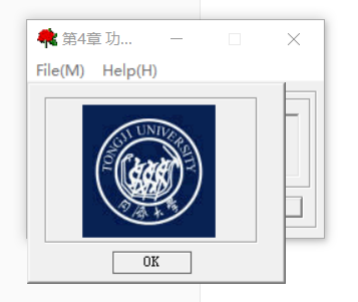
