# 寝室软路由记录

> 本文事件开始于 2020 年 5 月，部分内容可能不适用于当下，提及的硬件价格请以市场价格为准。

## 起因

说是软路由，实际上更像是一个低功耗的服务器了。除了路由系统之外，也可以作为一个 NAS 来使用，或者是在上面部署一些自己的服务。

决定组一台软路由的直接原因由于时间隔得太久，已经记不清了。但是装软路由的念头是从很久之前就有了。配一台电脑，有一个折腾的机会本身就是很让人感到兴奋的事了，再加上从最开始 linus[视频](https://www.bilibili.com/video/BV1vx411B7Db)里的服务器，到现在很多视频创作者分享的使用服务器储存，压制素材的经验，看到服务器给他们带来的便利，自己就也想体验一下了。

同时在寝室应用场景下，对于多设备网络连接和文件存储共享的需求比较强烈。一台服务器刚好能够覆盖我们的需求。

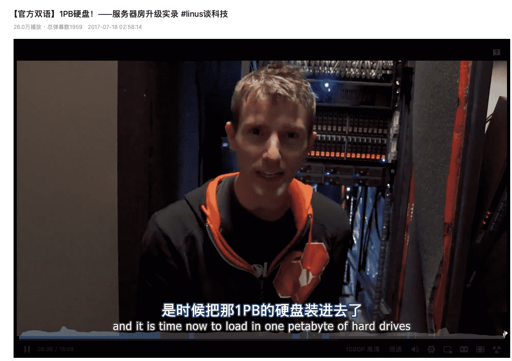

## 路程

### 选择

#### 硬件

在论坛上看到了很多 j1900 的方案，我们最开始也是选择了 J1900，但在某次机缘巧合下体验到它的性能之后就开始对选择产生了怀疑。

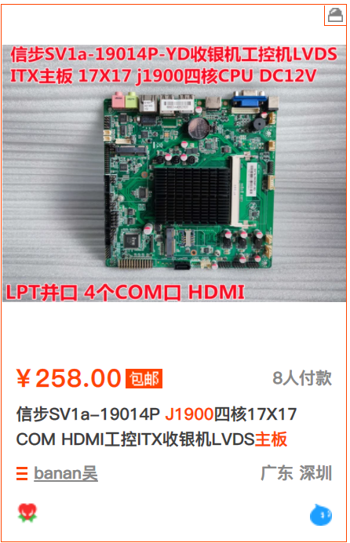

之后也看到了和 j1900 类似但是性能强一点的方案， 但是总还是看着感觉不靠谱。后来在 chh 上看到了一个用速龙 200ge 的方案，看起来靠谱很多，性能也够用，但是 TDP 和价格都高出不少。选择陷入了僵局。

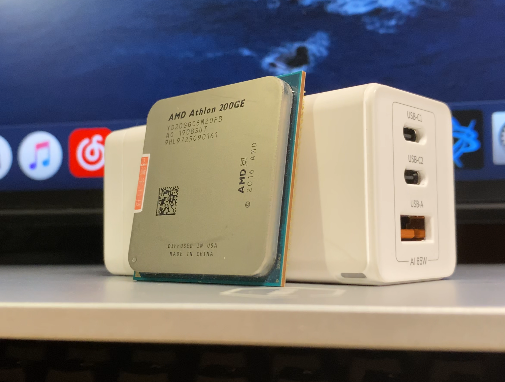

转机发生在看到了某位即将毕业学长发出的出售信息，学长的价格非常优惠。我们收购后，出售了功耗较高的部件，售后多余的资金和留下的机箱，磁盘等部件使得我们能够接受速龙 200ge 的价格，完成了软路由主机的配置。

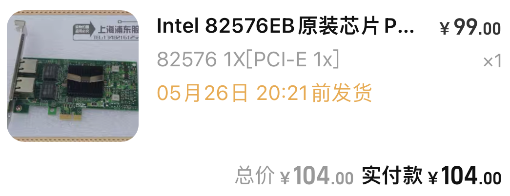

|      | 配件                         | 价格                             |
| ---- | ---------------------------- | -------------------------------- |
| CPU  | AMD 速龙 200ge               | -（和主板一起）                  |
| 主板 | 华擎 A320M                   | 489                              |
| 散热 | AMD“幽灵”棱镜 (Wraith Prism) | 12（朋友装机剩下的，只付了邮费） |
| 内存 | DDR4 8GB 2666                | 125                              |
| 显卡 | Radeon™ Vega 3 Graphics 核显 | -                                |
| 网卡 | 英特尔 82576EB 双口千兆      | 104                              |
| 机箱 | 收购再利用                   | -                                |
| 电源 | 先马 金牌 500W               | -                                |
| SSD  | 西数 SSD 240GB               | -（收购再利用）                  |
| HDD  | 希捷 HDD 1TB                 | -                                |
|      | 希捷 HDD 500GB               | -                                |
|      | 西数 HDD 500GB               | -                                |

电源和机械盘都是从家里拿来的之前用剩下的。最后抵扣出售二手部件的收入，总价格大概在 200-300 元。

#### 软件

在系统的选择上我们没有怎么纠结，直接选择了 Unraid。

考虑到出发点不是主要在存储上，对读写速度以及数据安全并没有太大的的要求，甚至存在上面的文件部分丢失应该也是可以接受的，我们就觉得 Unraid 这种可以后续添加硬盘的方式相比于 raid 会更加适合我们。Unraid 上可以友好的使用虚拟机和 Docker 也能让我们便利的部署一些自己的服务。再加上在 Linus 的视频里很多次看他用到了 Unraid，也想自己尝试一下。

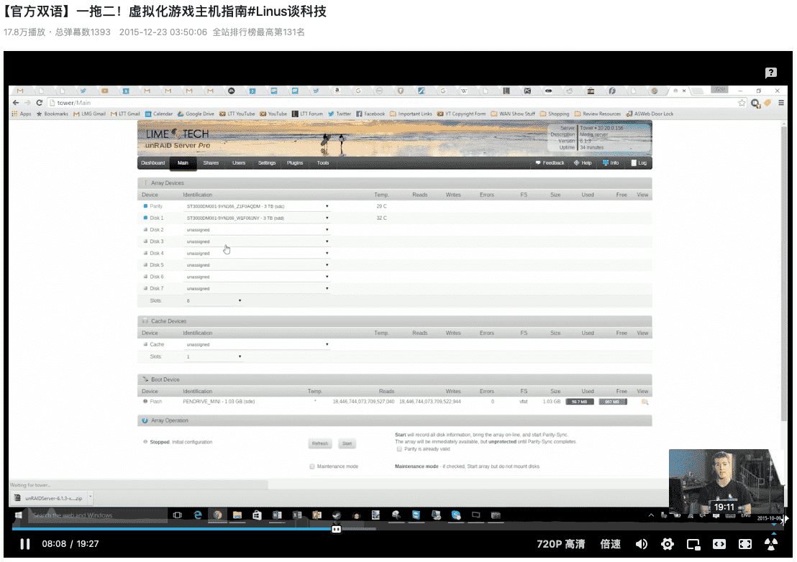

在路由系统上，由于之前在路由器上刷过 openwrt，对它的一些设置感觉已经有点熟练了，也成功实现校园网的拨号，这里就直接选择了继续使用 openwrt。

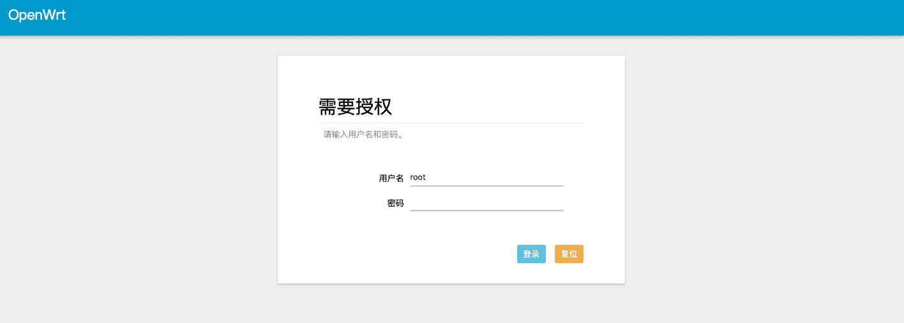

使用的固件出于网络等原因没有选择自己编译，在[恩山论坛](https://www.right.com.cn/forum/)上找了一个固件直接拿来用了。（具体的帖子已经找不到了。。。）

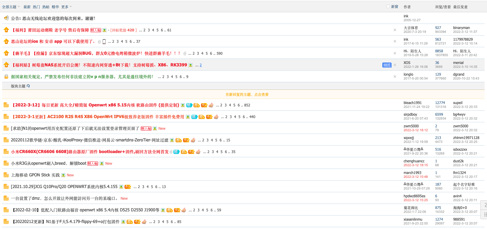

### 组装&配置

组装和配置的过程没有什么难的部分，跟着教程走就可以了。我们在配置的时候遇到的问题都是教程没有看清楚导致的。胆大心细，应该就没什么问题了。

#### 硬件部分

这里就只放几张组装时拍的图了。

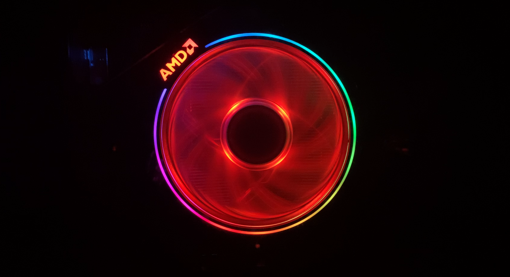

#### 软件部分

Unraid 的部分参考 b 站上司波图的[教程](https://www.bilibili.com/video/BV1nE411B73Y)就行了，讲的非常仔细，注意不要睡着就可以了。

## 

## 体验

### 储存

这个感觉是带来的最大便利。平时的一些学习资料或者游戏之类的大文件放在上面寝室里传一下很方便，出去帮忙修电脑的时候也可以直接用 ftp 连回来找一点工具或者安装包这种，活动要用的文件放在上面也方便参加的人直接去拿。

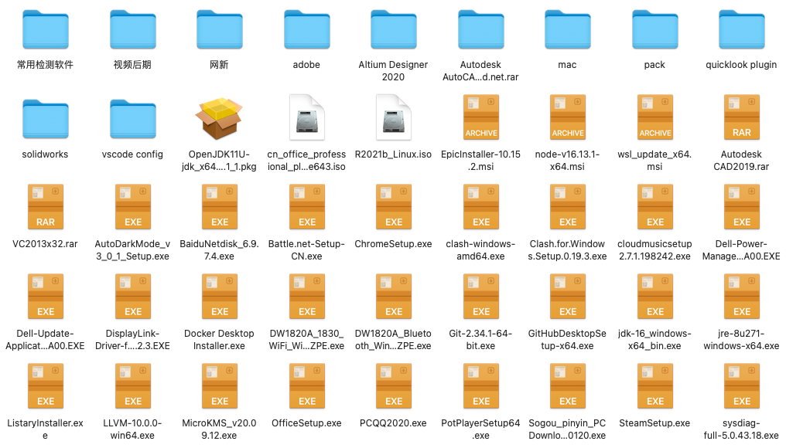

Mac 也可以用 Time Machine 备份在上面，用起来会安心一点。

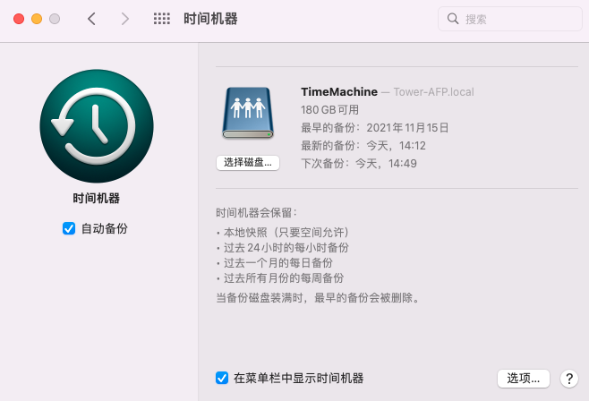

### 网络

在 openwrt 上使用校园网拨号上网，可以多设备连接。

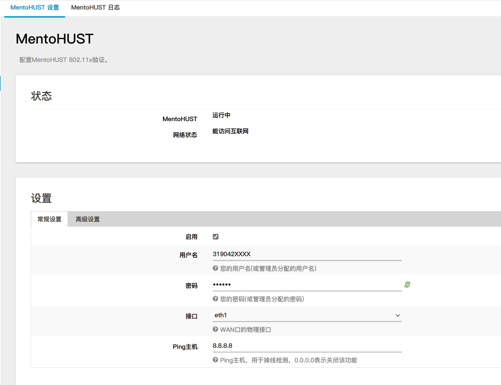

最后网络的布置是这样的。

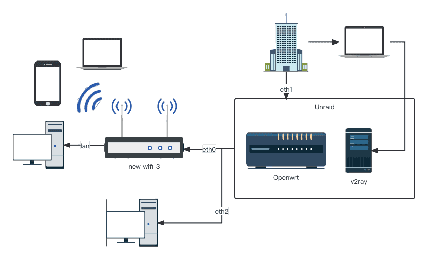

### Unraid

Unraid 用起来感觉还可以，比较适合我们这种陆续加硬盘的情况。图中的几块硬盘除了做缓存的固态，其余的都是从家里带来的旧硬盘。

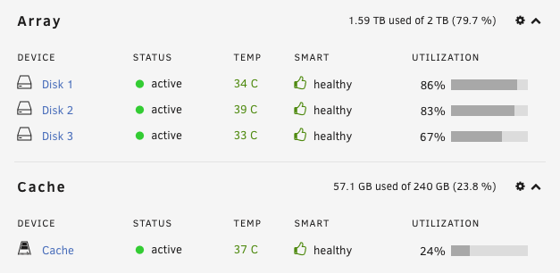

自带的 docker 和虚拟机用起来感觉都很方便。

v2ray 可以方便寝室里没有买校园网的几位室友连回寝室来上网，稍微省一点流量。

aria2 可以在校园网范围内控制远程下载，在下载大文件时比较方便。

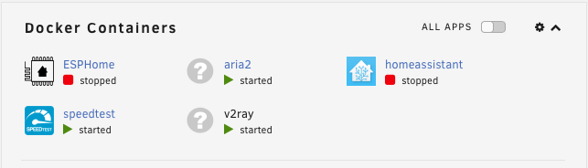

我们在上面开了两个虚拟机。一个装了 openwrt 做路由器，另一个装了 ubuntu，在需要部署一些服务的时候会用到。

在上面曾经部署过一个内网的 minecraft 服务器，实现校园网内部联机。

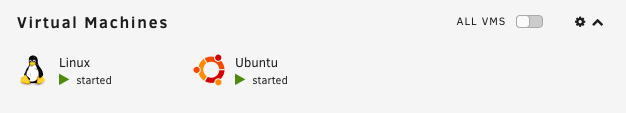

## 总结

总而言之，整套系统无论是文件存储还是 docker 应用部署，都十分便利。站在今天的角度上来看，当初选购 200ge 无疑是十分正确的选择，在购买后，市场上的 200ge 也出现了大幅涨价的现象。但是 A320 主板购入的价格略高，目前在闲鱼上 100 元左右应该就可以买到了。搭建这台软路由让我们大量接触到了计算机网络以及 linux 方面的知识，受益良多，在之后课程的学习上也有了可以实际参考的经验。

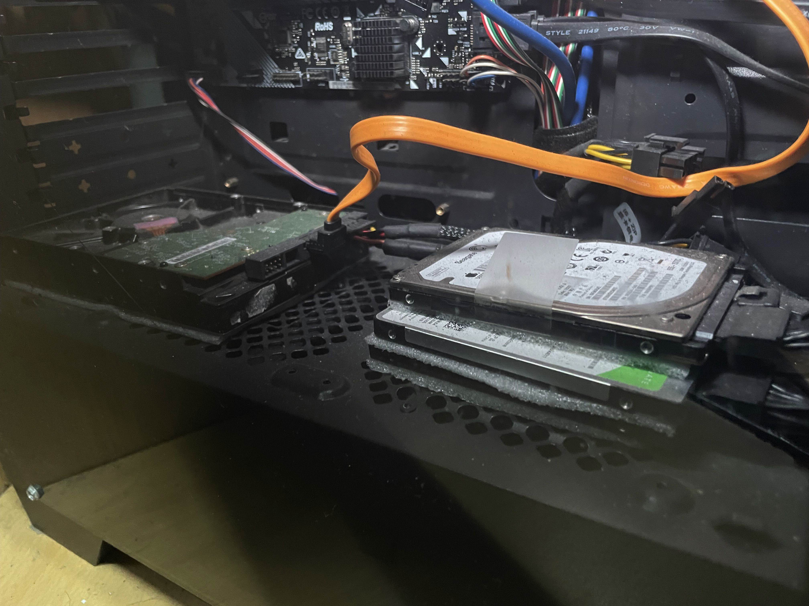
