# Visual Studio Code 入门指北

## 介绍

[vscode 的官方地址。](https://code.visualstudio.com/)

vscode 是由微软团队推出的一款**开源**的**代码编辑器**，有丰富的**扩展**。

---

## 为什么使用 vs code?

扩展支持**C/Cpp**的开发：

同时[vs code 内置 Emmet 支持](https://docs.emmet.io/cheat-sheet/)，前端是再合适不过了：

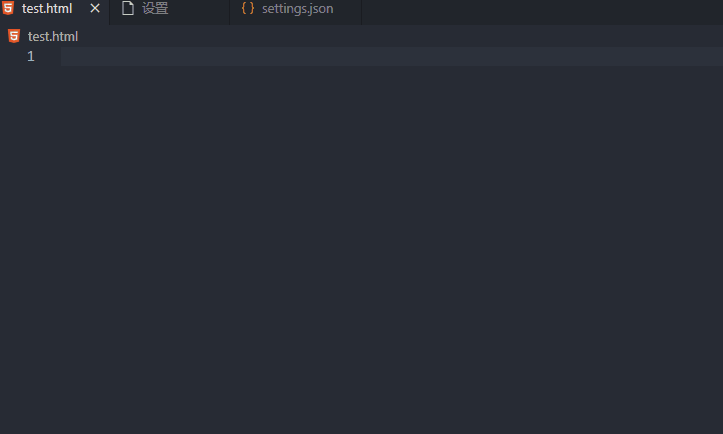

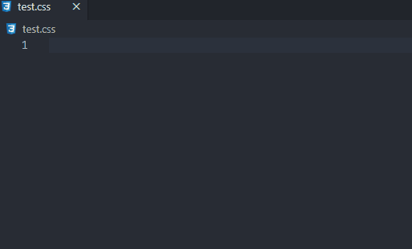

除此之外，**丰富的扩展**还能支持其他语言的开发：

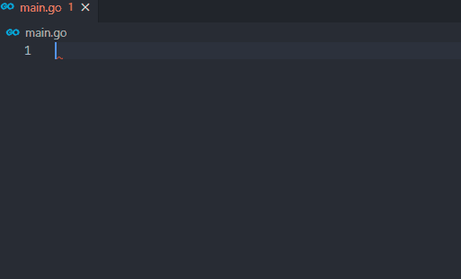

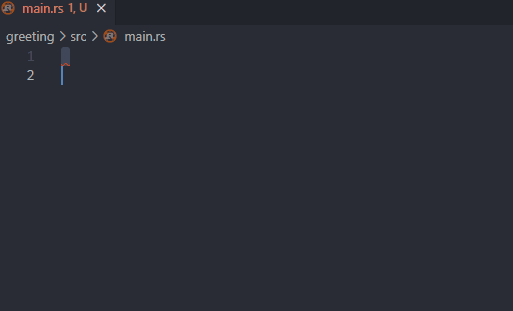

**重构**功能（快捷键`F2`）：

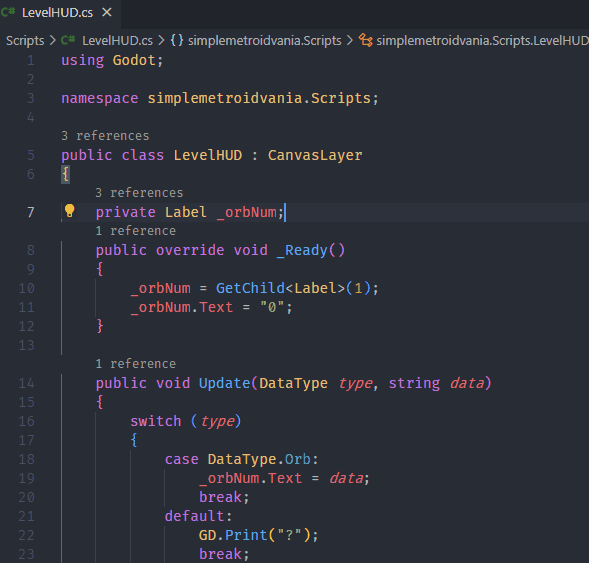

---

## 下载及安装

### 下载

[官方下载地址。](https://code.visualstudio.com/)

### 安装

下载完成后，双击运行开始安装：

1. 选择同意此协议，下一步；
2. 选择你希望安装的目录，下一步；
3. 可以更改你希望的开始菜单名或禁止创建开始菜单，下一步；
4. 各个选项按你自己需要选择，**通常情况下默认即可**，下一步；
5. 开始安装，等待完成即可。

## 快速开始

### 安装中文

第一次运行 vscode 时，右下角通知有提醒，可以直接**安装并重启**，界面就变成中文了。

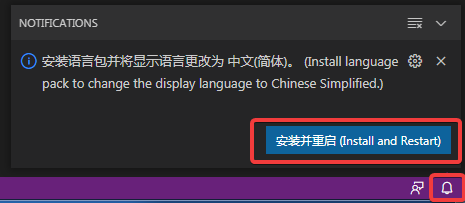

或者你可以点选左侧工具栏的**扩展(最下面)图标**，搜索框输入 Chinese，安装安装次数最高的那个语言插件并重启。

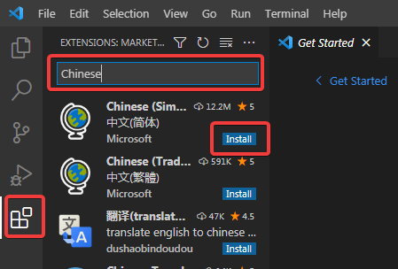

### 创建第一个项目

你可以随意的选择一个你希望保存你所有代码的目录，创建一个新的文件夹，在 vscode 中单击**文件**--**打开文件夹**选择新创建的文件夹并打开。

然后选择**是，我信任此作者**即可。

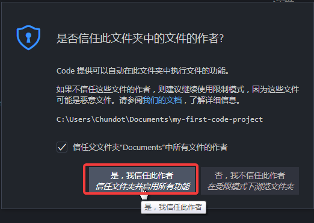

### 项目内创建文件夹或文件

点选左侧工具栏的**资源管理器**选项卡，或按下默认的快捷键：`Ctrl + Shift + E`。

红框四个图标代表新建文件、新建文件夹、刷新资源管理器，折叠文件夹(文件夹内容较多时有用)。

你也可以右击**蓝线**内区域进行操作。

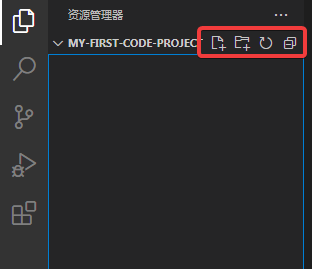

我们可以先新建一个`index.html`。

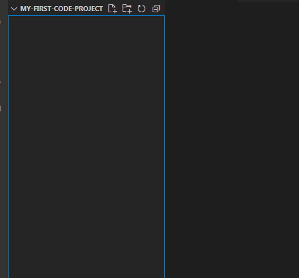

### 编辑代码

你可以单击或双击**资源管理器的文件**使其显示在编辑器中。点选我们刚创建的`index.html`(可能已经打开了)，在右侧即可开始编写代码。

对于 HTML 和 CSS，vscode 内置了[emmet](https://emmet.io/)，非常高效的前端**代码片段**合集。**我们之后将会更加详细讲解这部分功能**。

[在这里查阅 emmet 的奇技淫巧！](https://docs.emmet.io/cheat-sheet/)

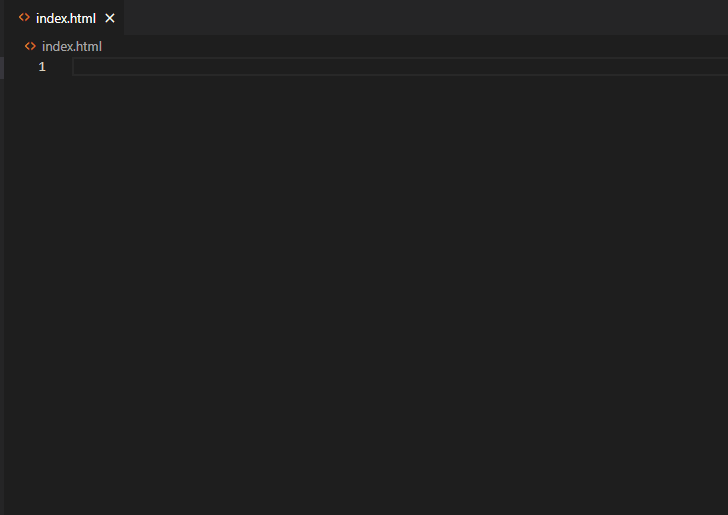

当然，其他的语言也会有高效的代码片段，你也可以在**扩展**中找到各式各样的代码片段包！

### 通用插件

这里主要介绍基本都会用到的插件。

#### One Dark Pro

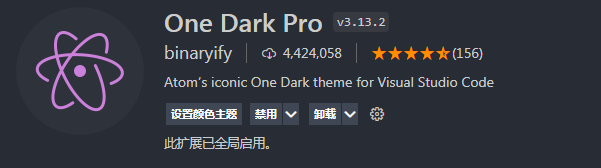

个人比较喜欢的编辑器配色插件。有三种方案可选。

当然，vscode 有好几种自带的配色方案，如果你觉得自带够用，你完全可以不安装这个插件！

#### vscode-icons

非常棒的图标库，为 vscode 添加及更新了许多文件和文件夹的图标（文件根据后缀名，文件夹根据名称自动更改图标）。

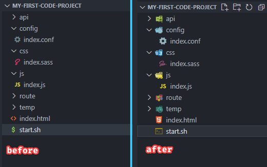

---

## 常用快捷键

### 编辑或查找快捷键

想要编辑快捷键或查看相关命令，你可以按下`Ctrl + K`再按下`Ctrl + S`。

比如，我想找与括号相关的快捷键，我可以输入 bracket 模糊搜索：

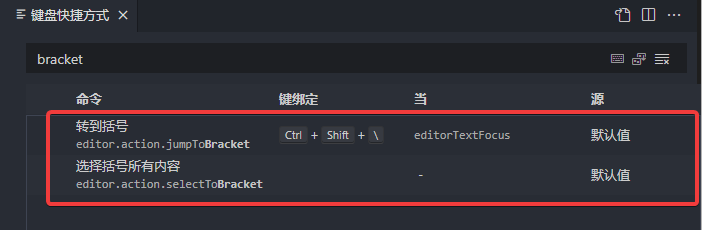

就找到了！有些操作按键默认留空，你可以为其分配你自己喜欢的快捷键。

---

### 常用快捷键介绍

下面介绍一些比较常用的快捷键。

#### 编辑器操作

##### 保存

`Ctrl + s`

你懂的。当然你也可以在下面提到的**设置**中配置**自动保存**。

##### 代码提示

`Ctrl + i`

有时候 vscode 的代码建议不会自动跳出。

每当你看不到代码提示感到心慌的时候，就按一下。

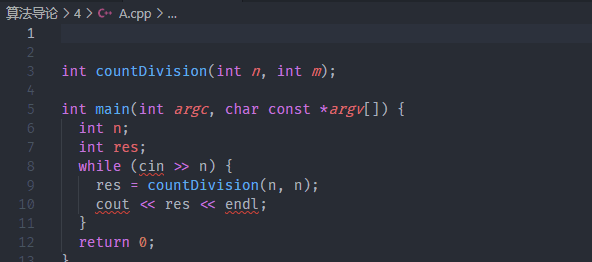

##### 移动行

`Alt + ↑`将代码向上移动一行。

`Alt + ↓`将代码向下移动一行。

##### 复制行

`Shift + Alt + ↑`或`Shift + Alt + ↓`，方向键决定向上或向下。

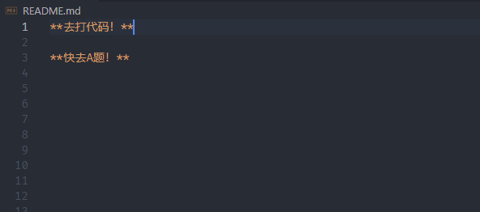

##### 复制光标

`Ctrl + Alt + ↑`或`Ctrl + Alt + ↓`，方向键决定向上或向下。

要同时对多行进行编辑的时候比较实用。

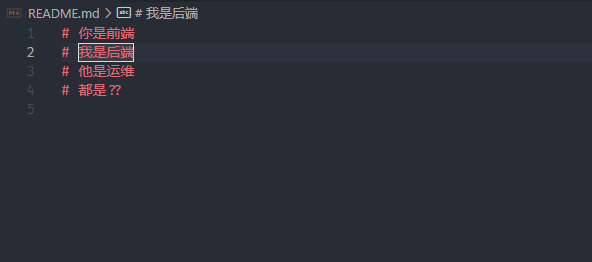

#### 其他操作

##### 显示命令面板

`Ctrl + Shift + p`

主题更改，扩展管理，编辑操作，文件格式化……所有命令操作都可以在这里执行。

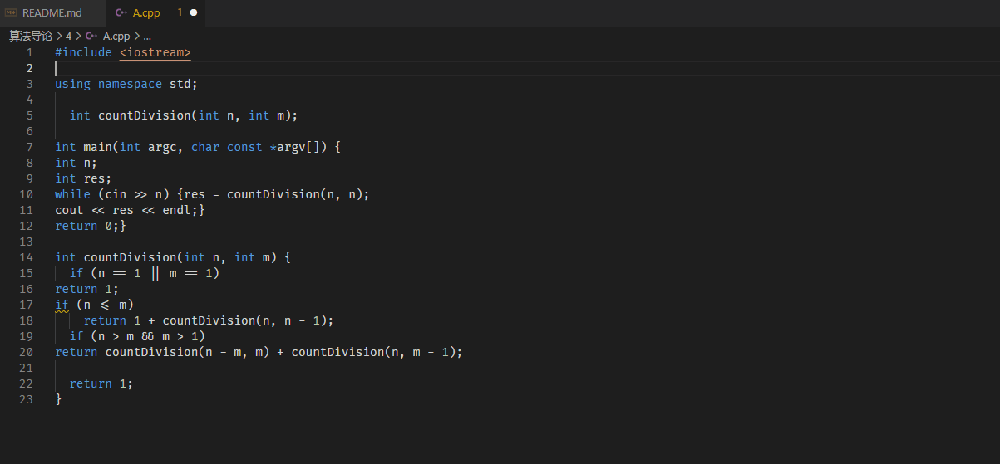

---

## 常用设置编辑

你可以点选左侧工具栏最下方的设置图标找到**设置**选项。

你可以使用快捷键`Ctrl + ,`打开 vscode 的设置选项。

### XX 时格式化

搜索框搜索**Format On**：

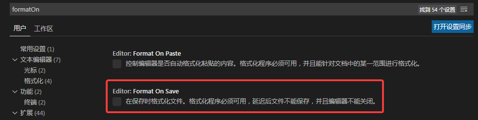

比较推荐勾选**Format On Save**，保存时自动使用文件默认的格式化程序。

### 自动保存

搜索框搜索**Auto Save**：

将光标移到选项上下方会有相应的说明，选择你喜欢的就行。

一般不太推荐开启，经常`Ctrl + s`也没有多麻烦。
